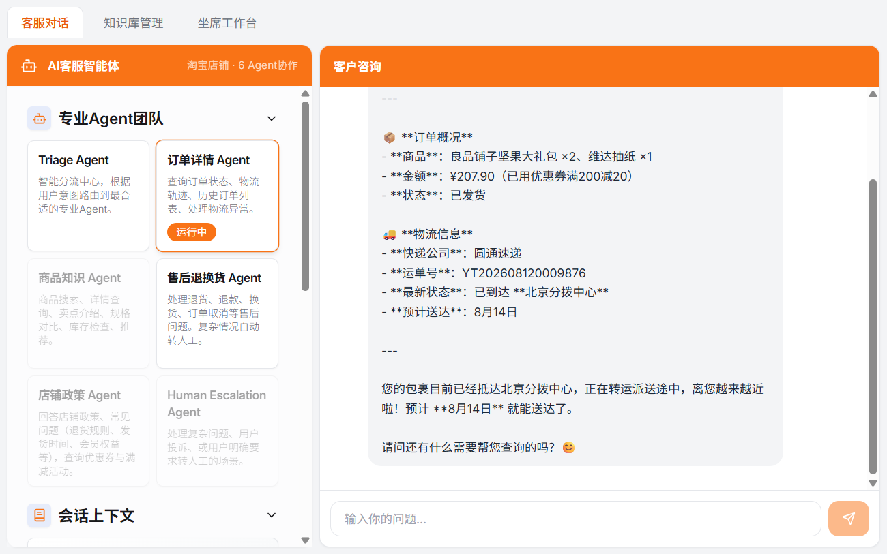

# AI 电商客服智能体 — 多 Agent + 完整 RAG + MCP + LangGraph

<p align="center">
  
  <br>
  <sup>淘宝店铺 · 6 Agent 协作 · 订单查询与物流追踪演示</sup>
</p>

> **TL;DR**
> 基于 OpenAI Agents SDK 改造的多智能体电商客服系统。**Triage 分诊 + 5 个专业业务 Agent 接力**，集成完整 RAG 检索管线、MCP Server 标准化、LangGraph 售后状态机与 Docker 容器化，内置 Human-in-the-Loop 兜底，**经 240 条黄金用例实测**。
>
> Fork 自 [openai/openai-cs-agents-demo](https://github.com/openai/openai-cs-agents-demo)，已完成电商场景业务化改造 + 工程化补全。

---

## 核心指标（实测）

| 指标 | 数字 |
|---|---|
| **Triage 意图识别准确率** | **98.75%**（240 / 240 条测试用例通过） |
| **RAG 检索 Recall@10** | **73.8%** |
| **RAG 检索 MRR@10** | **52.0%** |
| **Agent 数量** | **6** 个（Triage + 4 业务 + Human Escalation） |
| **工具数量** | **17** 个 function_tool |
| **容器镜像大小** | **2.6 GB**（CPU 版 torch，从 6 GB 瘦身） |

---

## 技术栈标签

`OpenAI Agents SDK` · `FastAPI` · `Next.js 15` · `DeepSeek API` · `BGE-small-zh` · `ChromaDB` · `BM25` · `RRF 融合检索` · `bge-reranker` · `FastMCP` · `LangGraph` · `SQLite（多租户）` · `Docker Compose`

---

## 文档与演示导航

| 类型 | 文件 | 说明 |
|---|---|---|
| 架构设计 | [DESIGN.md](DESIGN.md) | 系统架构、6 Agent 职责与 handoff 关系 |
| 技术方案 | [技术方案文档.md](技术方案文档.md) | 完整技术实现方案与关键决策 |
| 需求分析 | [需求分析文档.md](需求分析文档.md) | 业务场景、用户故事与验收标准 |
| 分流评测 | [分流评测报告.md](分流评测报告.md) | Triage 准确率 98.75% 的评测过程 |
| RAG 评测 | [RAG检索评测报告.md](RAG检索评测报告.md) | Recall@10 / MRR@10 的评测过程 |
| 数据选型 | [评测数据集选型与落地方案.md](评测数据集选型与落地方案.md) | 240 条用例设计思路 |
| 演示总览 | [docs/演示实录总览.html](docs/演示实录总览.html) | 8 个核心场景的完整演示录屏 |
| 演示截图 | [docs/screenshots/](docs/screenshots/) | 13 张核心流程截图 |
| 接入方案 | [抖音接入方案.md](抖音接入方案.md) | 抖音开放平台回调接入设计 |

---

## 核心亮点

1. **6 Agent 多智能体协作**：Triage 分诊 + 4 个业务 Agent + Human Escalation 兜底，handoff 接力而非简单串行。
2. **完整 RAG 检索管线**：双路召回（向量 + BM25）+ RRF 融合 + 交叉编码器重排 + 溯源。
3. **MCP 工具标准化**：知识库/订单能力封装为 4 个标准 MCP 工具，可跨客户端（Claude Desktop 等）复用。
4. **LangGraph 售后状态机**：售后流程显式建模，条件路由 + 可插人工审批。
5. **可降级工程化**：Embedding/重排失败自动降级，任何环境都能跑通。
6. **Human-in-the-Loop**：敏感/复杂场景自动转人工，生成结构化摘要与工单。
7. **多租户知识库**：SQLite 起步，`tenant_id` 预留迁移 PostgreSQL。
8. **轻量化容器化**：CPU torch 镜像 6 GB → 2.6 GB，模型卷与容器解耦。

---

## 一、系统架构

```
┌──────────────────────────────────────────────────────────────┐
│                      前端 (Next.js 15)                        │
│       Agent 监控面板 ｜ 客户咨询界面 ｜ 人工接管后台             │
└──────────────────────────┬───────────────────────────────────┘
                           │  /api/* 代理
┌──────────────────────────▼───────────────────────────────────┐
│                   后端 (FastAPI + Uvicorn)                     │
│  ┌────────────────────────────────────────────────────────┐  │
│  │        6 Agent 智能体（OpenAI Agents SDK）              │  │
│  │   Triage 分流                                          │  │
│  │   ├─ 订单详情 Agent（订单/物流）                         │  │
│  │   ├─ 商品知识 Agent（商品/库存）                         │  │
│  │   ├─ 售后退换货 Agent（退货/退款）                       │  │
│  │   ├─ 店铺政策 Agent（政策/优惠券）                       │  │
│  │   └─ Human Escalation Agent（人工兜底）                 │  │
│  └────────────────────────────────────────────────────────┘  │
│  ┌────────────────────────────────────────────────────────┐  │
│  │  完整 RAG 管线（rag/ 包）                                │  │
│  │  文档解析 → 分块 → BGE 向量化 → ChromaDB                 │  │
│  │  + BM25 → 混合检索(RRF) → bge-reranker 重排 → 溯源       │  │
│  ├────────────────────────────────────────────────────────┤  │
│  │  MCP Server（FastMCP） ｜ LangGraph 售后状态机           │  │
│  └────────────────────────────────────────────────────────┘  │
│  ┌────────────────────────────────────────────────────────┐  │
│  │  数据层：SQLite 知识库(多租户) ｜ 模拟商品/订单/优惠券    │  │
│  └────────────────────────────────────────────────────────┘  │
└──────────────────────────────────────────────────────────────┘
                           │
                     LLM (DeepSeek API)
```

---

## 二、技术栈

| 层 | 技术 |
|---|---|
| Agent 框架 | OpenAI Agents SDK（多 Agent + handoff） |
| 后端 | FastAPI + Uvicorn |
| 前端 | Next.js 15 + React + TailwindCSS |
| RAG 检索 | BGE-small-zh 向量化 + ChromaDB + BM25 + RRF 混合检索 + bge-reranker 重排 |
| MCP | FastMCP（知识库/订单查询封装为标准 MCP 工具） |
| 编排 | LangGraph（售后流程状态机 + 条件路由） |
| 知识库 | SQLite（多租户 tenant_id，预留迁 PostgreSQL） |
| 安全 | Input Guardrails（内容相关性 + 越狱检测） |
| 部署 | Docker Compose（含健康检查 + 卷持久化 + 模型挂载） |

---

## 三、快速开始

### 前置条件

- Python 3.11+
- Node.js 18+（前端）
- DeepSeek API Key（或任意兼容 OpenAI 协议的模型服务）
- Docker Desktop（可选，容器化部署用）

### 方式 A：本地开发运行

```bash
# 1. 后端
cd python-backend
python -m venv .venv
source .venv/bin/activate          # Windows: .venv\Scripts\activate
pip install -r requirements.txt

# 配置 API Key
cp .env.example .env                # 编辑 .env 填入 OPENAI_API_KEY / OPENAI_BASE_URL

# 启动后端（http://localhost:8000）
uvicorn main:app --reload            # Windows 未激活 venv 时：.venv\Scripts\uvicorn main:app --reload

# 2. 前端（另开终端）
cd ui
npm install
npm run dev:next                     # http://localhost:3000（仅前端；后端已在第 1 步单独启动）
```

> 注意：不要用 `npm run dev` 一键启动——它内部的 `dev:server` 脚本写的是 Linux 路径 `.venv/bin/uvicorn`，Windows 下会失败。请按上面两步分别启动后端和前端。

> 首次启动会自动建 SQLite 知识库并灌入默认商品知识。RAG 索引会在首次检索时自动构建。

### 方式 B：Docker 一键部署

```bash
# 在项目根目录，设置 API Key 后启动
export OPENAI_API_KEY=sk-your-key    # Windows: set OPENAI_API_KEY=sk-your-key
docker compose up -d --build
```

容器启动后访问 http://localhost:8000/health 应返回 `{"status":"healthy","service":"AI电商客服智能体","agents":"6"}`。

> **国内网络提示**：Dockerfile 默认走 DaoCloud 镜像源 + 清华 pip 源，并先装 CPU 版 torch（避免拉取 2GB+ CUDA 依赖）。若已配置 registry-mirror 或能直连 Docker Hub，可用 `--build-arg BASE_IMAGE=python:3.13-slim` 改回官方镜像。

---

## 四、各模块独立验证

不需要启动整个服务，各模块可独立跑通：

```bash
cd python-backend

# 1. 完整 RAG 管线（构建索引 + 混合检索 + 重排）
.venv/Scripts/python demo_rag.py              # Windows
# python demo_rag.py                            # macOS/Linux

# 2. LangGraph 售后状态机（3 类场景路由验证）
.venv/Scripts/python after_sales_graph.py

# 3. MCP Server（stdio 传输，供 MCP 客户端接入）
.venv/Scripts/python mcp_server.py
```

> 说明：BGE 中文模型（`data/models/`）需先用 `download_models.py` 下载；未下载时 RAG 会自动降级到 Chroma 默认 embedding，链路仍可用。

---

## 五、6 Agent 详情

| Agent | 职能 | 工具 |
|---|---|---|
| Triage Agent | 意图识别 + 路由分流 | — |
| 订单详情 Agent | 订单状态 / 物流轨迹 / 历史订单 | `order_status_tool` `list_customer_orders_tool` `tracking_lookup_tool` |
| 商品知识 Agent | 商品搜索 / 详情 / 库存 / 知识库检索 | `knowledge_search_tool` `product_info_tool` `search_products_tool` `inventory_check_tool` |
| 售后退换货 Agent | 退货 / 退款 / 取消 / 转人工 | `initiate_return_tool` `cancel_order_tool` `faq_lookup_tool` `escalate_to_human_tool` |
| 店铺政策 Agent | 政策问答 + 优惠券（RAG 增强） | `faq_lookup_tool` `rag_search_tool` `coupon_lookup_tool` |
| Human Escalation Agent | 复杂问题转人工，生成对话摘要 | `escalate_to_human_tool` |

**Handoff 流转**：Triage → 各业务 Agent →（复杂情况）→ Human Escalation，业务 Agent 完成或无关时回传 Triage。循环上限 `max_turns=10`。

---

## 六、RAG 检索管线

```
文档解析(pypdf/python-docx) → 语义分块(256/50) → BGE 向量化
   → ChromaDB(cosine+HNSW) + BM25(jieba) 双路召回
   → RRF 融合(k=60) → bge-reranker 精排 → 溯源
```

- **双路召回**：向量（语义）+ BM25（精确匹配，补商品 ID/专有名词盲区）
- **可降级设计**：Embedding 失败降级默认模型，重排失败自动跳过
- **可溯源**：chunk 携带 `{type, product_id, policy_name}` 元数据

---

## 七、MCP Server

`mcp_server.py` 将知识库/订单能力封装为 4 个标准 MCP 工具，供任意 MCP 客户端（Claude Desktop 等）统一调用：

- `search_knowledge` — 语义检索知识库
- `search_policy` — 检索店铺政策
- `get_order` — 查订单详情 + 物流
- `search_products` — 关键词搜商品

接入示例（MCP 客户端配置）：

```json
{
  "mcpServers": {
    "ecommerce-kb": {
      "command": "python",
      "args": ["mcp_server.py"],
      "cwd": "<python-backend 目录>"
    }
  }
}
```

---

## 八、项目结构

```
ai-cs-agent/
├── python-backend/
│   ├── main.py                # FastAPI 入口（/api/chat /api/knowledge /health）
│   ├── mcp_server.py          # FastMCP Server（4 工具）
│   ├── after_sales_graph.py   # LangGraph 售后状态机
│   ├── demo_rag.py            # RAG 独立验证脚本
│   ├── download_models.py     # BGE 模型下载（本地化）
│   ├── knowledge_store.py     # SQLite 知识库（多租户）
│   ├── doc_importer.py        # PDF/Word/TXT 文档导入 + LLM 提取
│   ├── rag/                   # 完整 RAG 包
│   │   ├── chunking.py        #   语义分块
│   │   ├── embedding.py       #   BGE 向量化（可降级）
│   │   ├── bm25.py            #   BM25 关键词检索
│   │   ├── vector_store.py    #   ChromaDB 封装
│   │   ├── reranker.py        #   bge-reranker 精排
│   │   ├── pipeline.py        #   混合检索 + RRF 融合
│   │   └── indexer.py         #   索引构建（backend 自动重建）
│   ├── ecommerce/
│   │   ├── agents.py          # 6 Agent 定义 + handoff 关系
│   │   ├── context.py         # 共享上下文
│   │   ├── tools.py           # 工具函数（含 RAG 接入）
│   │   ├── demo_data.py       # 模拟商品/订单/优惠券/政策
│   │   └── guardrails.py      # 安全护栏
│   ├── data/
│   │   ├── models/            # BGE 模型（本地，bind mount 挂载）
│   │   ├── chroma_rag/        # ChromaDB 向量库
│   │   └── knowledge.db       # SQLite 知识库
│   ├── Dockerfile             # 容器化（CPU torch + 国内源）
│   └── requirements.txt
├── ui/                        # Next.js 前端
├── docs/                      # 演示文档与截图
│   ├── screenshots/           # 13 张核心流程截图
│   └── 演示实录总览.html
├── docker-compose.yml         # 一键编排 + 模型卷挂载
├── README.md                  # 本文件
└── LICENSE                    # MIT License（基于 openai/openai-cs-agents-demo）
```

---

## 许可

MIT License — 基于 [openai/openai-cs-agents-demo](https://github.com/openai/openai-cs-agents-demo)
