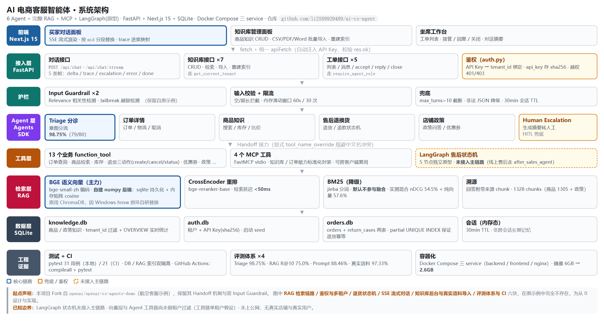
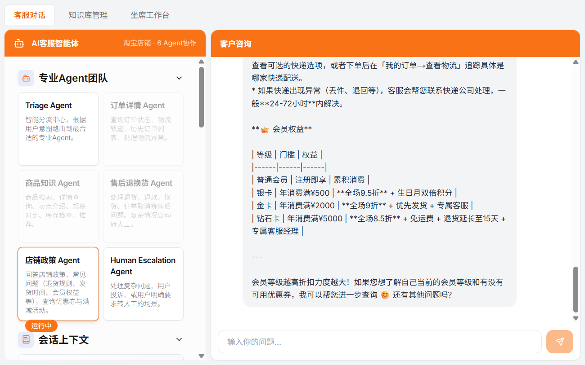
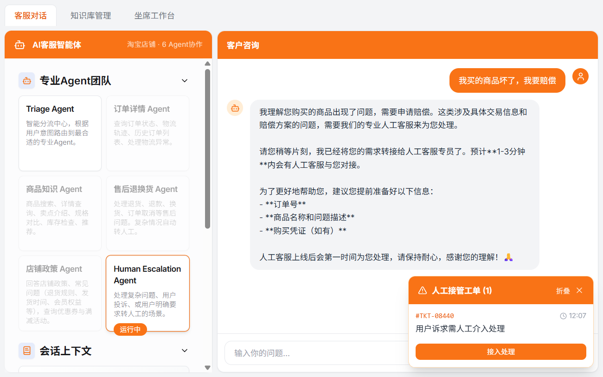
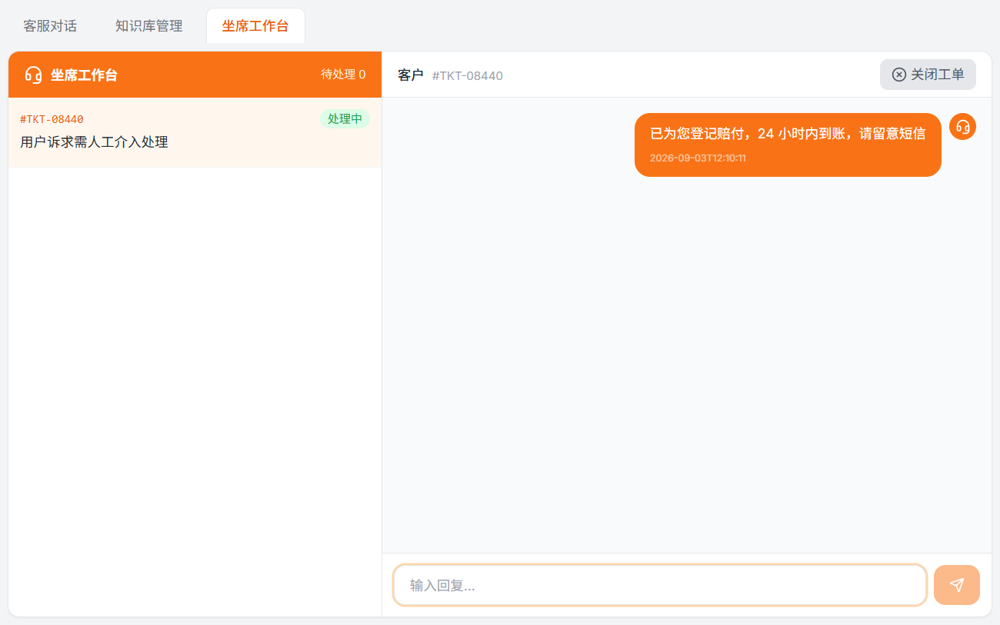

# AI 电商客服智能体 — 多 Agent + 完整 RAG + MCP + SSE 流式

[](https://github.com/li2589920489/ai-cs-agent/actions/workflows/ci.yml)


<p align="center">
  
  <br>
  <sup>七层架构：Next.js 15 前端 · FastAPI 接入 · 双 Guardrail · 6 Agent（Agents SDK） · 13 function_tool + 4 MCP 工具 · BGE + CrossEncoder RAG · SQLite 多租户 · CI/容器化<br>
  （本图源码见 <a href="docs/images/architecture.html">docs/images/architecture.html</a>，可自行改渲染）</sup>
</p>

> **TL;DR**
> 基于 OpenAI Agents SDK 改造的多智能体电商客服系统。**Triage 分诊 + 4 个业务 Agent + Human Escalation 兜底**，集成完整 RAG 检索管线（自建 numpy 向量后端）、MCP Server 标准化、SSE 流式对话、pytest + GitHub Actions 门禁与 Docker 容器化，**核心指标全部有可复跑的评测脚本**。
>
> Fork 自 [openai/openai-cs-agents-demo](https://github.com/openai/openai-cs-agents-demo)，**保留其 Handoff 机制与双 Input Guardrail**，在其之上完成了电商场景业务化 + 工程化补全。

---

## 原示例没有、本项目从 0 实现的 6 块能力

> 这是本仓库的真正增量。原示例（航空客服）**不含任何检索、鉴权、持久化、流式与测试能力**。

| # | 能力 | 原示例 | 本项目实现 | 代码位置 |
|---|---|---|---|---|
| 1 | **RAG 检索管线** | ❌ 无 | BGE 语义向量 + **自建 numpy 向量后端**（SQLite 持久化 + 内存矩阵 cosine）+ bge-reranker 重排 + 结果溯源 | `rag/`（9 个模块 916 行） |
| 2 | **鉴权与多租户** | ❌ 无 | API Key 存 sha256、启动 seed 租户、`get_current_tenant` / `require_agent_role` 依赖注入；知识库 7 接口 + 工单 5 接口全部收口，越权 401/403 | `auth.py` |
| 3 | **退货状态机** | ❌ 无 | `待审核 → 已通过 → 已寄回 → 已退款`（+ `已撤销`），用 **partial UNIQUE INDEX 在库层保证幂等**（不做应用层判重） | `order_store.py` |
| 4 | **SSE 流式对话** | ❌ 无（仅一次性返回） | `POST /api/chat/stream`，5 类帧 `delta/trace/escalation/error/done`；前端 `fetch` + `ReadableStream` 手工解帧 | `chat_service.py`、`ui/lib/sse.ts` |
| 5 | **知识库后台 + 真实语料导入** | ❌ 无 | 商品知识 CRUD + CSV/PDF/Word 批量导入；1300 条真实淘宝商品标题清洗入库（含 349 条违规词过滤） | `knowledge_store.py`、`scripts/import_real_products.py` |
| 6 | **评测体系 + CI 门禁** | ❌ 无 | 4 套可复跑评测脚本（Triage / RAG×2 / Prompt 对抗）+ pytest 31 用例 + GitHub Actions | `eval_*.py`、`tests/`、`.github/workflows/ci.yml` |

**规模**：6 Agent · 13 个业务 function_tool（+2 护栏 verdict）+ 4 个 MCP 工具 · 后端 58 个 `.py`（核心 7294 行）· 前端 27 个 `.ts/.tsx`（3158 行）· 全仓 140 个跟踪文件 · 迭代 7 次提交

---

## 核心指标（全部可复跑）

| 指标 | 数字 | 出处 |
|---|---|---|
| **Triage 意图分流准确率** | **98.75%**（79 / 80；easy 65/65 + hard 14/15） | `eval_routing.py` |
| **RAG Recall@10**（公开基准 EcomRetrieval） | **75.0%** | `eval_retrieval.py` |
| **RAG MRR@10 / nDCG@10** | **52.1% / 57.6%** | 同上 |
| **RAG Recall@10**（自有语料 90 query × 1300 商品） | **97.33%**（纯向量）/ 100%（混合） | `eval_real_corpus.py` |
| **Prompt 对抗性评测** | **88.46%**（v1 57.69% → **+30.77pp**） | `eval_prompt.py` |
| **知识库批量入库** | 1305 条 **0 失败**（1328 chunks） | `scripts/import_real_products.py` |
| **检索延迟** | **< 50 ms**（含 reranker） | `docs/真实商品导入工程.md` |
| **测试** | 本地 **31 passed** · CI 21 passed + 1 skipped | `python -m pytest` |
| **容器镜像** | 6 GB → **2.6 GB**（CPU 版 torch） | `Dockerfile` |

> **指标口径（请连同数字一起读，避免误引）**
> - **Triage `98.75%` 是单次实测，不是稳定值**：6 个 Agent 未固定 `temperature`（走 DeepSeek 默认值），复跑实测 **96.25% / 97.50% / 98.75%**，三次错题集互不重叠。引用口径应以「单次实测 98.75%，实测区间 96.25%–98.75%」表述；要拿可复现数字需先把 `temperature` 置 0。详见 [分流评测报告.md](分流评测报告.md)。
> - **RAG `75.0%` 是公开学术基准上的数字**（跨域 10 万语料），不是线上业务数据；自有小规模受控语料上趋势相反（混合检索 100% > 纯向量 97.33%），这是发现而非矛盾，见 [docs/真实query评测报告.md](docs/真实query评测报告.md)。
> - Prompt `88.46%` 为多轮复跑稳定区间 **88%–92%** 的取值。

---

## 演示

<p align="center">
  
  
  <br>
  
  
  <br>
  <sup>
  <b>① Triage 分流到订单 Agent</b>：流式输出 + 工具调用轨迹 ｜ <b>② 政策问题走 RAG</b>：回答带来源 chunk 溯源<br>
  <b>③ 复杂纠纷自动转人工</b>：生成结构化摘要与工单 ｜ <b>④ 坐席工作台接管回复</b>：买家侧实时收到
  </sup>
  <br><br>
  <sub>全部 13 张流程截图（含知识库导入前后对比、安全护栏拒绝等）见 <a href="docs/screenshots/">docs/screenshots/</a></sub>
</p>

---

## 与原示例（openai-cs-agents-demo）的差异

> 本项目 Fork 自 [openai/openai-cs-agents-demo](https://github.com/openai/openai-cs-agents-demo)，**保留其 Handoff 机制与双 Input Guardrail 设计**，在此基础上补齐电商场景业务化与工程化能力。

| 能力维度 | 原示例 | 本项目 |
|---|---|---|
| 业务场景 | 航空客服（airline） | 电商客服（ecommerce：订单/商品/售后/政策） |
| Agent | 5（Triage + 4 业务） | **6**（Triage + 4 业务 + Human Escalation 兜底） |
| Handoff | ✅ SDK 原生 | ✅ 保留（显式 `tool_name_override` 规避中文名冲突） |
| Input Guardrail | ✅ 2 个 | ✅ 保留双 Guardrail（相关性 + 越狱） |
| 上下文 Context | 基础字段 | 扩展至 17 字段（订单/客户/退货/商品/优惠券） |
| **RAG 检索** | ❌ 无 | ✅ 完整管线（BGE 向量 + **自建 numpy 后端** + BM25 降级 + 重排 + 溯源） |
| **鉴权 / 多租户** | ❌ 无 | ✅ API Key → tenant_id 绑定、sha256 存储、知识库与工单接口全部收口（**向量层与 Agent 工具链仍是单租户假设，见「已知边界」**） |
| **退货状态机** | ❌ 无 | ✅ 4 态流转 + 撤销回滚，partial UNIQUE INDEX 库层幂等 |
| **SSE 流式对话** | ❌ 无 | ✅ 5 类帧协议 + 前端手工解帧 + nginx 流式三指令 |
| **知识库管理后台** | ❌ 无 | ✅ 商品知识 CRUD + CSV/PDF/Word 批量导入 + 重建索引 |
| **测试与 CI** | ❌ 无 | ✅ pytest 31 用例（DB / RAG 索引双隔离）+ GitHub Actions 门禁 |
| MCP | ❌ 无 | ✅ FastMCP 4 工具（知识库/订单标准化，可跨客户端复用） |
| LangGraph | ❌ 无 | ⚠️ 售后状态机**独立验证原型，未接入 Agent 主链路**（线上售后走 `after_sales_agent`） |
| 评测体系 | ❌ 无 | ✅ 4 套可复跑评测（Triage 98.75% / RAG 75.0% / 自有语料 97.33% / Prompt 88.46%） |
| 容器化 | ❌ 无 | ✅ Docker Compose 三 service，镜像 6GB → 2.6GB |

---

## 文档与演示导航

| 类型 | 文件 | 说明 |
|---|---|---|
| 架构设计 | [DESIGN.md](DESIGN.md) | 系统架构、6 Agent 职责与 handoff 关系 |
| 技术方案 | [技术方案文档.md](技术方案文档.md) | 完整技术实现方案与关键决策 |
| 需求分析 | [需求分析文档.md](需求分析文档.md) | 业务场景、用户故事、验收标准与能力边界 |
| 变更记录 | [CHANGELOG.md](CHANGELOG.md) | 按版本记录的 Added / Changed / Fixed / **Verified（含实测数据）** |
| 开发规约 | [AGENTS.md](AGENTS.md) | 协作红线、死组件标注、口径约束 |
| 部署指南 | [docs/启动与部署指南.md](docs/启动与部署指南.md) | 两种启动方案对比、数据卷差异、故障排查 |
| **评测 · 分流** | [分流评测报告.md](分流评测报告.md) | Triage 98.75% 的评测过程、混淆矩阵、错题漂移分析 |
| **评测 · 检索（公开基准）** | [RAG检索评测报告.md](RAG检索评测报告.md) | EcomRetrieval 1000q × 100902c 四模式对比、互补性诊断、RRF 加权扫描 |
| **评测 · 检索（自有语料）** | [docs/真实query评测报告.md](docs/真实query评测报告.md) | 90 条自建 query，与公开基准趋势相反的发现 |
| **评测 · Prompt 对抗性** | [docs/prompt_对抗性评测.md](docs/prompt_对抗性评测.md) | 26 条用例（13 条对抗难例），v1→v2 +30.77pp |
| 评测设计 | [评测数据集选型与落地方案.md](评测数据集选型与落地方案.md) | 数据集选型思路与落地步骤 |
| 语料工程 | [docs/真实商品导入工程.md](docs/真实商品导入工程.md) | 1300 条真实商品导入的清洗、分块与延迟实测 |
| 演示截图 | [docs/screenshots/](docs/screenshots/) | 13 张核心流程截图（含索引 README） |
| 抖音接入 | [抖音接入方案.md](抖音接入方案.md) | 抖店开放平台回调接入设计 + Mock 联调 |
| 淘宝接入 | [淘宝接入方案.md](淘宝接入方案.md) | TOP API 接入设计 + 坐席一键确认 Mock 联调 |

---

## 核心亮点

1. **6 Agent 多智能体协作**：Triage 分诊 + 4 个业务 Agent + Human Escalation 兜底，`handoff` 接力而非简单串行，循环上限 `max_turns=10`。
2. **RAG 检索管线 + 数据驱动决策**：BGE 语义向量（主力）+ CrossEncoder 重排 + 溯源；BM25(jieba) 作为可插拔降级兜底，**不参与默认融合**——这是基于 EcomRetrieval（1000 query × 10 万 corpus）实测做出的取舍：混合检索 nDCG 最高 54.5% **低于**纯向量 57.6%，且加权到 5:1 仍反超不了。BM25 的召回增量只有 3.4%，却污染了 27.8%「仅向量命中」query 的排序。
3. **自建向量后端**：ChromaDB 1.5.x 在 Windows 上 hnsw segment 生成失败（`count()/get()/query()` 全抛异常但数据完整躺在 SQLite 里）→ 自己实现 SQLite 持久化 + 内存矩阵 cosine 检索，语义等价，**向量层外部依赖从 6 个降到 0 个**。
4. **SSE 真流式**：`POST /api/chat/stream` 逐帧下发（`delta` 带消息标识 `mid`、`done` 带权威 `reply`）；前端用 `fetch` + `ReadableStream` 手工解帧（`EventSource` 只支持 GET，且要处理 UTF-8 多字节跨 chunk）。**隔离实验定位到 nginx 缺 `proxy_buffering off`** 时帧到达跨度只有 1ms（全攒到末尾），补齐三指令后 1856ms（真流式）。
5. **MCP 工具标准化**：知识库/订单能力封装为 4 个标准 MCP 工具，可跨客户端（Claude Desktop 等）复用。
6. **库层幂等而非应用层判重**：退货单用 partial UNIQUE INDEX 在 SQLite 层保证「同一订单同租户至多一个活跃退货单」，避免「查-写」窗口期的并发双单。
7. **可降级工程化**：Embedding / 重排失败自动跳过，BM25 与向量服务互为兜底，任何环境都能跑通链路。
8. **Human-in-the-Loop**：敏感/复杂场景自动转人工，生成结构化摘要与工单，坐席在工作台接管回复。
9. **多租户知识库**：SQLite + `tenant_id` 字段 + 查询层过滤 + API Key 鉴权，预留迁移 PostgreSQL。
10. **测试隔离达标**：`conftest.py` 隔离 4 个持久化路径（`KNOWLEDGE_DB_PATH` / `AUTH_DB_PATH` / `ORDER_DB_PATH` / `RAG_PERSIST_DIR`），跑完测试生产态产物一字未变（有 A/B 对照验证）。
11. **轻量化容器化**：CPU 版 torch + 模型卷 bind mount 解耦，镜像 6 GB → 2.6 GB。

---

## 一、系统架构

```
┌──────────────────────────────────────────────────────────────┐
│                      前端 (Next.js 15)                        │
│      买家对话（SSE 流式） ｜ 知识库管理面板 ｜ 坐席工作台        │
└──────────────────────────┬───────────────────────────────────┘
                           │  /api/* 代理（统一 apiFetch，自动注入 API Key）
┌──────────────────────────▼───────────────────────────────────┐
│                   后端 (FastAPI + Uvicorn)                     │
│  ┌────────────────────────────────────────────────────────┐  │
│  │        6 Agent 智能体（OpenAI Agents SDK）              │  │
│  │   Triage 分流                                          │  │
│  │   ├─ 订单详情 Agent（订单/物流）                         │  │
│  │   ├─ 商品知识 Agent（商品/库存）                         │  │
│  │   ├─ 售后退换货 Agent（退货/退款）                       │  │
│  │   ├─ 店铺政策 Agent（政策/优惠券）                       │  │
│  │   └─ Human Escalation Agent（人工兜底）                 │  │
│  └────────────────────────────────────────────────────────┘  │
│  ┌────────────────────────────────────────────────────────┐  │
│  │  完整 RAG 管线（rag/ 包，9 模块）                        │  │
│  │  文档解析 → 分块 → BGE 向量化 → numpy(cosine) 检索      │  │
│  │  → bge-reranker 重排 → 溯源                              │  │
│  │  （BM25 仅作可插拔降级兜底，不参与默认融合）              │  │
│  ├────────────────────────────────────────────────────────┤  │
│  │  MCP Server（FastMCP 4 工具）                            │  │
│  │  LangGraph 售后状态机（独立原型，未接入主链路）           │  │
│  └────────────────────────────────────────────────────────┘  │
│  ┌────────────────────────────────────────────────────────┐  │
│  │  数据层：knowledge.db / auth.db / orders.db（SQLite）    │  │
│  │          + 会话记忆（内存态 30min TTL）                  │  │
│  └────────────────────────────────────────────────────────┘  │
└──────────────────────────────────────────────────────────────┘
                           │
                     LLM (DeepSeek API)
```

**三条关键链路**：① 检索链路（BGE 向量 → reranker → 溯源）② 工具链路（13 function_tool + 4 MCP 工具）③ 鉴权链路（API Key → tenant_id → 接口收口）。

---

## 二、技术栈

| 层 | 技术 |
|---|---|
| Agent 框架 | OpenAI Agents SDK（多 Agent + handoff + guardrails） |
| 后端 | FastAPI + Uvicorn |
| 前端 | Next.js 15 + React + TailwindCSS（三栏 keep-mounted 布局） |
| RAG 检索 | BGE-small-zh 向量化 + 自建 numpy 向量后端 + bge-reranker 重排（BM25 仅作降级兜底） |
| MCP | FastMCP（知识库/订单查询封装为标准 MCP 工具） |
| 售后原型 | LangGraph（售后流程状态机，**独立验证原型，未接入主链路**） |
| 知识库 | SQLite（多租户 tenant_id + API Key 鉴权，预留迁 PostgreSQL） |
| 实时输出 | SSE（5 类帧协议）+ 前端 `fetch`/`ReadableStream` 手工解帧 |
| 安全 | Input Guardrails（内容相关性 + 越狱检测）、输入校验与内存滑动窗口限流 |
| 测试与 CI | pytest（31 用例，DB / 索引双隔离）+ GitHub Actions（compileall + pytest） |
| 部署 | Docker Compose（backend / frontend / nginx 三 service，含健康检查 + 卷持久化 + 模型挂载） |

---

## 三、快速开始

### 前置条件

- Python 3.10（本地 `.venv` 3.10.11、CI `python-version: "3.10"`、生产镜像 `python:3.13-slim`）
- Node.js 18+（前端）
- DeepSeek API Key（或任意兼容 OpenAI 协议的模型服务）
- Docker Desktop（可选，容器化部署用）

### 方式 A：本地开发运行

```bash
# 1. 后端
cd python-backend
python -m venv .venv
source .venv/bin/activate          # Windows: .venv\Scripts\activate
pip install -r requirements.txt

# 配置 API Key
cp .env.example .env                # 编辑 .env 填入 OPENAI_API_KEY / OPENAI_BASE_URL

# 启动后端（http://localhost:8000）
python -m uvicorn main:app --reload   # Windows 未激活 venv 时：.venv\Scripts\python -m uvicorn main:app --reload

# 2. 前端（另开终端）
cd ui
npm install
npm run dev:next                     # http://localhost:3000（仅前端；后端已在第 1 步单独启动）
```

> **Windows 一键启动**：`npm run dev` 会用 `concurrently` 同时拉起前后端（`dev:server` 脚本已适配 Windows 路径）。若想日志分开看，也可按上面两步分终端启动。
>
> 首次启动会自动建 SQLite 知识库并灌入默认商品知识（4 条 demo 商品），并通过 FastAPI `lifespan` 预热 RAG（加载 embedding / reranker 与索引），**首问不再冷启动**（实测预热后首问 < 5s，此前同步建索引阻塞 70.9s）。
>
> **若要导入本地 1300 条真实商品**，见 [docs/启动与部署指南.md](docs/启动与部署指南.md) 与 [docs/真实商品导入工程.md](docs/真实商品导入工程.md)。

### 方式 B：Docker 一键部署

```powershell
# 前置：先启动 Docker Desktop（daemon 未运行会报 npipe / Connection refused）

# 1. 切到项目根目录（compose 文件所在处，否则报 no configuration file provided）
cd <项目根目录>

# 2. 确认 python-backend/.env 已填 OPENAI_API_KEY（compose 通过 env_file 自动读取）
#    无需在 shell 里 export，.env 里的值会注入容器

# 3. 构建并启动三服务（backend + frontend + nginx）
docker compose up -d --build
```

启动后访问 **http://localhost/**（nginx 统一入口）：后端 `/health` 返回 `{"status":"healthy","service":"AI电商客服智能体","agents":"6"}`，前端返回客服界面。

> **国内网络提示**：Dockerfile 默认走 DaoCloud 镜像源 + 清华 pip 源 + npmmirror，并先装 CPU 版 torch（避免拉取 2GB+ CUDA 依赖）。若已配置 registry-mirror 或能直连 Docker Hub，可用 `--build-arg BASE_IMAGE=python:3.13-slim` 改回官方镜像。
>
> **常见坑**：① 必须 cd 到项目根目录再执行；② Docker Desktop 必须先启动；③ 重建过 backend/frontend 后若出现 502，执行 `docker compose restart nginx`（旧 nginx 缓存了已失效的容器 IP）。完整排查见 [docs/启动与部署指南.md](docs/启动与部署指南.md)。

---

## 四、各模块独立验证

不需要启动整个服务，各模块可独立跑通：

```bash
cd python-backend

# 1. 完整 RAG 管线（构建索引 + 向量检索 + 重排）
python -m demo_rag

# 2. LangGraph 售后状态机（3 类场景路由验证）
python -m after_sales_graph

# 3. MCP Server（stdio 传输，供 MCP 客户端接入）
python -m mcp_server
```

> 说明：BGE 中文模型（`data/models/`）需先用 `python -m download_models` 下载；未下载时 RAG 会自动降级，链路仍可用。

---

## 五、6 Agent 详情

| Agent | 职能 | 工具 |
|---|---|---|
| Triage Agent | 意图识别 + 路由分流 | — |
| 订单详情 Agent | 订单状态 / 物流轨迹 / 历史订单 | `order_status_tool` `list_customer_orders_tool` `tracking_lookup_tool` |
| 商品知识 Agent | 商品搜索 / 详情 / 库存 / 知识库检索 | `knowledge_search_tool` `product_info_tool` `search_products_tool` `inventory_check_tool` |
| 售后退换货 Agent | 退货 / 退款 / 取消 / 转人工 | `initiate_return_tool` `cancel_order_tool` `faq_lookup_tool` `escalate_to_human_tool` |
| 店铺政策 Agent | 政策问答 + 优惠券（RAG 增强） | `faq_lookup_tool` `rag_search_tool` `coupon_lookup_tool` |
| Human Escalation Agent | 复杂问题转人工，生成对话摘要 | `escalate_to_human_tool` |

**Handoff 流转**：Triage → 各业务 Agent →（复杂情况）→ Human Escalation，业务 Agent 完成或无关时回传 Triage。循环上限 `max_turns=10`。

---

## 六、RAG 检索管线

```
文档解析(pypdf/python-docx) → 语义分块(256/50) → BGE 向量化
   → numpy(cosine) 向量检索（主力）
   → bge-reranker 交叉编码重排（精排头部） → 溯源
```

- **最终方案（数据驱动定型）**：纯 BGE 语义向量 + CrossEncoder 重排，BM25(jieba) 作为可插拔降级兜底组件（向量服务不可用时启动）。EcomRetrieval（1000 query × 100902 corpus）实测：纯向量 Recall@10=75.0% / nDCG@10=57.6%，加权 RRF 扫描最优 nDCG=54.5% 仍反超不了纯向量，故放弃默认混合检索。详见 [RAG检索评测报告.md](RAG检索评测报告.md)。
- **自建向量后端**：`rag/numpy_store.py` —— SQLite 持久化 + 内存矩阵 cosine，语义等价于 hnsw 暴搜，本项目千级 chunk 规模下延迟更低、依赖为 0。
- **可降级设计**：① Embedding 失败降级默认模型；② 重排失败自动跳过；③ 向量服务不可用时启动 BM25 兜底。
- **可溯源**：chunk 携带 `{type, product_id, policy_name}` 元数据，回答可回溯到来源文档。

---

## 七、MCP Server

`mcp_server.py` 将知识库/订单能力封装为 4 个标准 MCP 工具，供任意 MCP 客户端（Claude Desktop 等）统一调用：

- `search_knowledge` — 语义检索知识库
- `search_policy` — 检索店铺政策
- `get_order` — 查订单详情 + 物流
- `search_products` — 关键词搜商品

接入示例（MCP 客户端配置）：

```json
{
  "mcpServers": {
    "ecommerce-kb": {
      "command": "python",
      "args": ["-m", "mcp_server"],
      "cwd": "<python-backend 目录>"
    }
  }
}
```

---

## 八、评测体系

| # | 评测 | 评测集 | 结论 | 脚本 |
|---|---|---|---|---|
| ① | Triage 意图分流 | 自建 80 条（easy 65 / hard 15） | **98.75%**（单次实测） | `eval_routing.py` |
| ② | RAG 检索（公开基准） | `C-MTEB/EcomRetrieval` 1000q × 100902c | 纯向量 **R@10 75.0%** / MRR 52.1% / nDCG 57.6% | `eval_retrieval.py` `eval_rrf_tuning.py` |
| ③ | RAG 检索（自有语料） | 自建 90 条（75 正例 + 15 未收录） | 纯向量 **97.33%** / 混合 **100%** | `eval_real_corpus.py` |
| ④ | Prompt 对抗性 | 26 条（13 happy + 13 对抗） | v1 57.69% → **88.46%** | `eval_prompt.py` |

```bash
cd python-backend
python -m eval_routing                    # ① 全量 80 条（约 6 分钟）
python -m eval_retrieval                  # ② 四种模式全量对比
python -m eval_rrf_tuning                 # ② 互补性诊断 + 加权扫描
python -m eval_real_corpus                # ③ 自有语料三模式对比
python -m eval_prompt                     # ④ 对抗性评测
```

> **数据集出处**：`C-MTEB/EcomRetrieval` 是 [C-MTEB 中文向量基准](https://github.com/FlagOpen/FlagEmbedding)（BAAI）收录的公开学术检索数据集，语料来自**阿里电商搜索引擎**的真实商品/段落文本，HuggingFace 上的数据集 ID 为 `C-MTEB/EcomRetrieval`（下载脚本：[`download_ecom_retrieval.py`](python-backend/download_ecom_retrieval.py)，国内可用 `HF_ENDPOINT=https://hf-mirror.com`）。**它是公开学术基准，不含任何客户业务数据**；仓库内的订单/客户数据均为虚构 demo 数据（`P1001`–`P1004`）。

---

## 九、测试与 CI

```bash
cd python-backend
python -m pytest -q          # 完整环境 31 passed
```

| 测试文件 | 用例 | 覆盖 |
|---|---|---|
| `tests/test_chat_stream.py` | 9 | SSE 5 类帧协议、`delta.mid` 分段、前言替换、`done.reply` 权威性、早退分支（全 mock） |
| `tests/test_smoke.py` | 10 | 健康检查、鉴权、RAG 检索冒烟（无模型时 skip） |
| `tests/test_return_state.py` | 8 | 退货状态机流转、库层幂等、撤销回滚 |
| `tests/test_api_contracts.py` | 4 | API 契约 |

- **四路径隔离**：`conftest.py` 把 `KNOWLEDGE_DB_PATH` / `AUTH_DB_PATH` / `ORDER_DB_PATH` / `RAG_PERSIST_DIR` 全部指向临时目录 —— 修掉了「跑 pytest 会把开发索引从 1328 chunks 打成 28 chunks」的污染（有 A/B 对照验证：修复后索引 chunks 与 mtime 完全不变）。
- **CI**：`.github/workflows/ci.yml` 做 `compileall` 语法检查 + `python -m pytest`，只装精简依赖（不装 torch / sentence-transformers），无 key / 无本地模型时 LLM 与 RAG 用例自动 skip。
- **CI 自诊断**：失败时把关键行冒泡成 `::error::<line>` annotation —— job 日志下载需要仓库 admin 权限（`/actions/jobs/{id}/logs` 免鉴权 403），而 check-run annotations 对公开仓库免鉴权可读。

---

## 十、已知边界（不回避）

| # | 边界 | 现状 |
|---|---|---|
| 1 | LangGraph 售后状态机 | 独立原型跑通（5 节点），**未接入 Agent 主链路**；线上售后走 Agents SDK 的 `after_sales_agent`。接入点已定位：`initiate_return_tool` 内改调 `run_after_sales()` |
| 2 | 向量层租户隔离 | 未做。当前是**工具链单租户假设**：Agent 商品工具链与向量检索层都不带 tenant 过滤，只有知识库 CRUD / LIKE 检索做了 `WHERE tenant_id=?`。已知待补项，修法 3 步已写进方案文档 |
| 3 | 公网部署 / 真实用户 | 未上线，仅本地 Docker Compose 三 service；无真实店铺、无真实用户（淘宝接入卡在营业执照资质，方案文档里全是占位符） |
| 4 | 会话记忆 | 内存态 30 min TTL，**不是跨会话长期记忆** |
| 5 | 坐席密钥下发 | `NEXT_PUBLIC_TENANT_API_KEY` 会被打进前端 bundle，生产环境应改为服务端代理注入（已在 `ui/.env.example` 标注） |
| 6 | Triage 指标稳定性 | 未固定 `temperature`，指标存在波动，见「核心指标 · 口径」 |

---

## 十一、项目结构

```
ai-cs-agent/
├── python-backend/
│   ├── main.py                    # FastAPI 入口（/api/chat /api/chat/stream /api/knowledge /health）
│   ├── chat_service.py            # 共享 run_chat() / run_chat_stream()：消息→Triage→Agent→回复+trace
│   ├── auth.py                    # 鉴权：API Key(sha256) → tenant_id 绑定、依赖注入收口
│   ├── order_store.py             # 订单/退货工单持久化 + 退货状态机（库层幂等）
│   ├── knowledge_store.py         # SQLite 知识库（多租户 + 指纹防重复向量化）
│   ├── mcp_server.py              # FastMCP Server（4 工具）
│   ├── after_sales_graph.py       # LangGraph 售后状态机（独立原型，未接入主链路）
│   ├── memory_store.py            # 会话记忆（内存态 30min TTL）
│   ├── doc_importer.py            # PDF/Word/TXT 文档导入 + LLM 抽取
│   ├── server.py                  # ★ ChatKit 桥接（死代码：全仓无 import，唯一入口是 uvicorn main:app）
│   ├── demo_rag.py                # RAG 独立验证脚本
│   ├── download_models.py         # BGE 模型下载（本地化，避 hf-mirror + Xet 损坏）
│   ├── download_ecom_retrieval.py # C-MTEB/EcomRetrieval 数据集下载
│   ├── restore_models.py          # 从 HF 缓存恢复 BGE 模型
│   ├── eval_routing.py            # ① Triage 路由评测（80 条）
│   ├── eval_retrieval.py          # ② RAG 检索评测（公开基准 4 模式）
│   ├── eval_rrf_tuning.py         # ② RRF 调参实验（推翻混合检索）
│   ├── eval_real_corpus.py        # ③ 自有语料检索评测（90 query × 1300 商品）
│   ├── eval_prompt.py             # ④ Prompt 对抗性评测（26 条）
│   ├── rag/                       # RAG 包（9 模块 916 行）
│   │   ├── chunking.py            #   语义分块
│   │   ├── embedding.py           #   BGE 向量化（可降级）
│   │   ├── numpy_store.py         #   自建向量后端：SQLite 持久化 + 内存矩阵 cosine
│   │   ├── vector_store.py        #   向量后端兼容层
│   │   ├── bm25.py                #   BM25 关键词检索（降级兜底）
│   │   ├── reranker.py            #   bge-reranker 精排
│   │   ├── pipeline.py            #   检索编排（向量 + 可选融合 + 重排）
│   │   ├── indexer.py             #   索引构建（支持 RAG_PERSIST_DIR 覆盖）
│   │   └── __init__.py            #   get_pipeline() 双重检查加锁
│   ├── ecommerce/
│   │   ├── agents.py              # 6 Agent 定义 + handoff 关系 + instructions
│   │   ├── context.py             # 共享上下文（17 字段）
│   │   ├── tools.py               # 13 个业务工具（含 RAG 接入）
│   │   ├── demo_data.py           # 模拟商品/订单/优惠券/政策
│   │   └── guardrails.py          # 2 个 Input Guardrail + 2 个 verdict 工具
│   ├── tests/                     # pytest 31 用例（conftest 四路径隔离）
│   ├── scripts/                   # build_real_query_eval.py / import_real_products.py / verify_*.py
│   ├── data/                      # models(模型) / chroma_rag(索引) / eval(评测集与结果) / *.db
│   ├── Dockerfile                 # 容器化（CPU torch + 国内源）
│   └── requirements.txt
├── ui/                            # Next.js 15 前端
│   ├── components/                #   chat-panel / knowledge-panel / agent-workspace / escalation-panel ...
│   └── lib/                       #   api.ts / sse.ts（SSE 解帧）/ chat-stream.ts（进度态）/ types.ts
├── docs/
│   ├── images/                    # 架构图（architecture.png + 可渲染源码 .html）
│   ├── screenshots/               # 13 张核心流程截图 + 索引
│   ├── 启动与部署指南.md
│   ├── 真实商品导入工程.md
│   ├── prompt_对抗性评测.md
│   └── 真实query评测报告.md
├── .github/workflows/ci.yml       # CI 门禁（compileall + pytest + 失败冒泡 annotation）
├── docker-compose.yml             # 三 service 编排 + 模型卷挂载
├── nginx.conf                     # 反向代理（/api/ 含流式三指令：proxy_buffering off 等）
├── DESIGN.md / 技术方案文档.md / 需求分析文档.md / CHANGELOG.md / AGENTS.md
├── 分流评测报告.md / RAG检索评测报告.md / 评测数据集选型与落地方案.md
├── 抖音接入方案.md / 淘宝接入方案.md
└── LICENSE                        # MIT License（基于 openai/openai-cs-agents-demo）
```

---

## 十二、迭代时间线

| 日期 | 提交 | 内容 |
|---|---|---|
| 2026-09-06 | `5e0b1c7` | 初始化：场景从航空改造为电商，FastAPI + Next.js 基座，多租户字段起步 |
| 2026-09-07 | `0d5e69d` | 淘宝/抖店接入适配层（OAuth2 + AES-256-CBC + 签名）+ Mock 联调；数字口径与实测对齐 |
| 2026-09-29 | `862fd2a` | H 系列工程改造 + 退货状态机（预热、落盘一致、鉴权收口、库层幂等） |
| 2026-09-29 | `1e6b7cc` | 引入 pytest 回归体系与 CI 门禁（DB + RAG 索引双隔离） |
| 2026-09-29 | `a891694` | CI 失败时冒泡 check-run annotation（无 admin 权限也能自诊断） |
| 2026-09-29 | `149a6d2` | 修复裸 pytest 的 sys.path 问题 + RAG 用例 skip 条件 |
| 2026-09-29 | `c4d6f99` | SSE 流式收尾：前言泄漏修复 + 文档口径同步 |

> 提交边界可自查：`git log --oneline | head -7`（本仓库前 7 条提交即上述改造，`5e0b1c7` 之前为上游 `openai/openai-cs-agents-demo` 的 38 条历史）。

---

## 许可

MIT License — 基于 [openai/openai-cs-agents-demo](https://github.com/openai/openai-cs-agents-demo)
