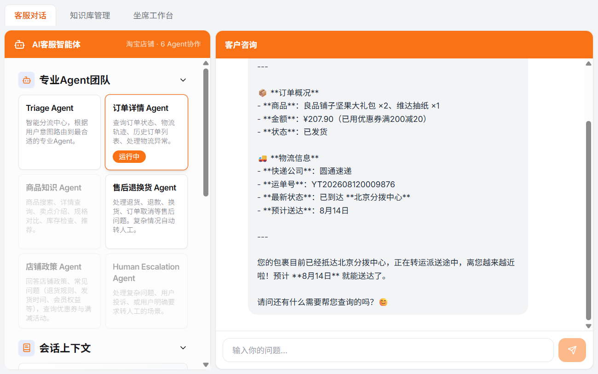

# AI 电商客服智能体 — 多 Agent + 完整 RAG + MCP + LangGraph

[](https://github.com/li2589920489/ai-cs-agent/actions/workflows/ci.yml)

<p align="center">
  
  <br>
  <sup>淘宝店铺 · 6 Agent 协作 · 订单查询与物流追踪演示</sup>
</p>

> **TL;DR**
> 基于 OpenAI Agents SDK 改造的多智能体电商客服系统。**Triage 分诊 + 5 个专业业务 Agent 接力**，集成完整 RAG 检索管线、MCP Server 标准化、LangGraph 售后状态机与 Docker 容器化，内置 Human-in-the-Loop 兜底，**经 80 条黄金用例实测**。
>
> Fork 自 [openai/openai-cs-agents-demo](https://github.com/openai/openai-cs-agents-demo)，已完成电商场景业务化改造 + 工程化补全。

---

## 核心指标（实测）

| 指标 | 数字 |
|---|---|
| **Triage 意图识别准确率** | **98.75%**（79 / 80 条测试用例通过；easy 65/65 + hard 14/15）|
| **RAG 检索 Recall@10**（纯向量） | **75.0%** |
| **RAG 检索 MRR@10**（纯向量） | **52.1%** |
| **RAG 检索 nDCG@10**（纯向量） | **57.6%** |
| **Agent 数量** | **6** 个（Triage + 4 业务 + Human Escalation） |
| **工具数量** | **15 个 function_tool（业务 13 + 护栏 verdict 2）+ 4 个 MCP 工具 = 19 个工具** |
| **容器镜像大小** | **2.6 GB**（CPU 版 torch，从 6 GB 瘦身） |

---

## 与原示例（openai-cs-agents-demo）的差异

> 本项目 Fork 自 [openai/openai-cs-agents-demo](https://github.com/openai/openai-cs-agents-demo)，**保留其 Handoff 机制与双 Input Guardrail 设计**，在此基础上补齐电商场景业务化与工程化能力。

| 能力维度 | 原示例 | 本项目 |
|---|---|---|
| 业务场景 | 航空客服（airline） | 电商客服（ecommerce：订单/商品/售后/政策） |
| Agent | 5（Triage + 4 业务） | 6（Triage + 4 业务 + Human Escalation 兜底） |
| Handoff | ✅ SDK 原生 | ✅ 保留（显式 tool_name_override 规避中文名冲突） |
| Input Guardrail | ✅ 2 个 | ✅ 保留双 Guardrail（相关性 + 越狱），改为函数式护栏 |
| 上下文 Context | 基础字段 | 扩展至 17 字段（订单/客户/退货/商品/优惠券） |
| RAG 检索 | ❌ 无 | ✅ 完整管线（BGE 向量 + numpy 后端 + BM25 降级 + 重排 + 溯源） |
| MCP | ❌ 无 | ✅ FastMCP 4 工具（知识库/订单标准化） |
| LangGraph | ❌ 无 | ✅ 售后状态机独立验证原型（未接入 Agent 主链路） |
| 多租户 | ❌ 无 | ✅ tenant_id 字段 + 查询层过滤 + API Key 鉴权（预留迁 PostgreSQL） |
| 评测体系 | ❌ 无 | ✅ Triage 98.75% / RAG 75.0% / Prompt 88.46% |
| 容器化 | ❌ 无 | ✅ Docker Compose，镜像 6GB → 2.6GB |

---

## 技术栈标签

`OpenAI Agents SDK` · `FastAPI` · `Next.js 15` · `DeepSeek API` · `BGE-small-zh` · `numpy 向量库` · `bge-reranker` · `FastMCP` · `LangGraph` · `SQLite（多租户）` · `Docker Compose`

---

## 文档与演示导航

| 类型 | 文件 | 说明 |
|---|---|---|
| 架构设计 | [DESIGN.md](DESIGN.md) | 系统架构、6 Agent 职责与 handoff 关系 |
| 技术方案 | [技术方案文档.md](技术方案文档.md) | 完整技术实现方案与关键决策 |
| 需求分析 | [需求分析文档.md](需求分析文档.md) | 业务场景、用户故事与验收标准 |
| 分流评测 | [分流评测报告.md](分流评测报告.md) | Triage 准确率 98.75% 的评测过程 |
| RAG 评测 | [RAG检索评测报告.md](RAG检索评测报告.md) | Recall@10 / MRR@10 的评测过程 |
| 数据选型 | [评测数据集选型与落地方案.md](评测数据集选型与落地方案.md) | 80 条用例设计思路 |
| 演示截图 | [docs/screenshots/](docs/screenshots/) | 13 张核心流程截图 |
| 抖音接入 | [抖音接入方案.md](抖音接入方案.md) | 抖店开放平台回调接入设计 + Mock 联调 |
| 淘宝接入 | [淘宝接入方案.md](淘宝接入方案.md) | TOP API 接入设计 + 坐席一键确认 Mock 联调 |

---

## 核心亮点

1. **6 Agent 多智能体协作**：Triage 分诊 + 4 个业务 Agent + Human Escalation 兜底，handoff 接力而非简单串行。
2. **RAG 检索管线 + 数据驱动决策**：BGE 语义向量检索（主力）+ CrossEncoder 重排 + 溯源；BM25(jieba) 作为可插拔降级兜底组件，**不参与默认融合**——这是基于 EcomRetrieval（1000 query × 10 万 corpus）实测数据做出的取舍（混合检索 nDCG 最高 54.5% < 纯向量 57.6%）。
3. **MCP 工具标准化**：知识库/订单能力封装为 4 个标准 MCP 工具，可跨客户端（Claude Desktop 等）复用。
4. **LangGraph 售后状态机**：售后流程显式建模，条件路由 + 可插人工审批。
5. **可降级工程化**：Embedding/重排失败自动降级，任何环境都能跑通。
6. **Human-in-the-Loop**：敏感/复杂场景自动转人工，生成结构化摘要与工单。
7. **多租户知识库**：SQLite + `tenant_id` 字段 + 查询层过滤 + API Key 鉴权，预留迁移 PostgreSQL。
8. **轻量化容器化**：CPU torch 镜像 6 GB → 2.6 GB，模型卷与容器解耦。

---

## 一、系统架构

```
┌──────────────────────────────────────────────────────────────┐
│                      前端 (Next.js 15)                        │
│       Agent 监控面板 ｜ 客户咨询界面 ｜ 人工接管后台             │
└──────────────────────────┬───────────────────────────────────┘
                           │  /api/* 代理
┌──────────────────────────▼───────────────────────────────────┐
│                   后端 (FastAPI + Uvicorn)                     │
│  ┌────────────────────────────────────────────────────────┐  │
│  │        6 Agent 智能体（OpenAI Agents SDK）              │  │
│  │   Triage 分流                                          │  │
│  │   ├─ 订单详情 Agent（订单/物流）                         │  │
│  │   ├─ 商品知识 Agent（商品/库存）                         │  │
│  │   ├─ 售后退换货 Agent（退货/退款）                       │  │
│  │   ├─ 店铺政策 Agent（政策/优惠券）                       │  │
│  │   └─ Human Escalation Agent（人工兜底）                 │  │
│  └────────────────────────────────────────────────────────┘  │
│  ┌────────────────────────────────────────────────────────┐  │
│  │  完整 RAG 管线（rag/ 包）                                │  │
│  │  文档解析 → 分块 → BGE 向量化 → numpy 向量检索        │  │
│  │  → bge-reranker 重排 → 溯源                              │  │
│  │  （BM25 仅作可插拔降级兜底，不参与默认融合）              │  │
│  ├────────────────────────────────────────────────────────┤  │
│  │  MCP Server（FastMCP） ｜ LangGraph 售后状态机           │  │
│  └────────────────────────────────────────────────────────┘  │
│  ┌────────────────────────────────────────────────────────┐  │
│  │  数据层：SQLite 知识库(多租户) ｜ 模拟商品/订单/优惠券    │  │
│  └────────────────────────────────────────────────────────┘  │
└──────────────────────────────────────────────────────────────┘
                           │
                     LLM (DeepSeek API)
```

---

## 二、技术栈

| 层 | 技术 |
|---|---|
| Agent 框架 | OpenAI Agents SDK（多 Agent + handoff） |
| 后端 | FastAPI + Uvicorn |
| 前端 | Next.js 15 + React + TailwindCSS |
| RAG 检索 | BGE-small-zh 向量化 + numpy 向量检索 + bge-reranker 重排（BM25 仅作降级兜底） |
| MCP | FastMCP（知识库/订单查询封装为标准 MCP 工具） |
| 编排 | LangGraph（售后流程状态机 + 条件路由） |
| 知识库 | SQLite（多租户 tenant_id + API Key 鉴权，预留迁 PostgreSQL） |
| 安全 | Input Guardrails（内容相关性 + 越狱检测） |
| 部署 | Docker Compose（含健康检查 + 卷持久化 + 模型挂载） |

---

## 三、快速开始

### 前置条件

- Python 3.10（本地 `.venv` 3.10.11、CI `python-version: "3.10"`、生产镜像 `python:3.13-slim`）
- Node.js 18+（前端）
- DeepSeek API Key（或任意兼容 OpenAI 协议的模型服务）
- Docker Desktop（可选，容器化部署用）

### 方式 A：本地开发运行

```bash
# 1. 后端
cd python-backend
python -m venv .venv
source .venv/bin/activate          # Windows: .venv\Scripts\activate
pip install -r requirements.txt

# 配置 API Key
cp .env.example .env                # 编辑 .env 填入 OPENAI_API_KEY / OPENAI_BASE_URL

# 启动后端（http://localhost:8000）
uvicorn main:app --reload            # Windows 未激活 venv 时：.venv\Scripts\uvicorn main:app --reload

# 2. 前端（另开终端）
cd ui
npm install
npm run dev:next                     # http://localhost:3000（仅前端；后端已在第 1 步单独启动）
```

> **Windows 一键启动**：`npm run dev` 会用 `concurrently` 同时拉起前后端（`dev:server` 脚本已适配 Windows 路径）。若想日志分开看，也可按上面两步分终端启动。
>
> 首次启动会自动建 SQLite 知识库并灌入默认商品知识（4 条 demo 商品）。RAG 索引在首次检索时自动构建；**若要导入本地 1300 条真实商品，见《启动与部署指南》**。

### 方式 B：Docker 一键部署

```powershell
# 前置：先启动 Docker Desktop（daemon 未运行会报 npipe / Connection refused）

# 1. 切到项目根目录（compose 文件所在处，否则报 no configuration file provided）
cd <项目根目录>                       # 本项目：D:\下载应用\个人ai训练中心\ai-cs-agent

# 2. 确认 python-backend/.env 已填 OPENAI_API_KEY（compose 通过 env_file 自动读取）
#    无需在 shell 里 export，.env 里的值会注入容器

# 3. 构建并启动三服务（backend + frontend + nginx）
docker compose up -d --build
```

启动后访问 **http://localhost/**（nginx 统一入口）：后端 `/health` 返回 `{"status":"healthy","service":"AI电商客服智能体","agents":"6"}`，前端返回客服界面。

> **国内网络提示**：Dockerfile 默认走 DaoCloud 镜像源 + 清华 pip 源 + npmmirror，并先装 CPU 版 torch（避免拉取 2GB+ CUDA 依赖）。若已配置 registry-mirror 或能直连 Docker Hub，可用 `--build-arg BASE_IMAGE=python:3.13-slim` 改回官方镜像。
>
> **常见坑**：① 必须 cd 到项目根目录再执行；② Docker Desktop 必须先启动；③ 重建过 backend/frontend 后若出现 502，执行 `docker compose restart nginx`（旧 nginx 缓存了已失效的容器 IP）。完整排查见《启动与部署指南》。

完整说明（含两种方案对比、数据卷差异、故障排查）见 **[docs/启动与部署指南.md](docs/启动与部署指南.md)**。

---

## 四、各模块独立验证

不需要启动整个服务，各模块可独立跑通：

```bash
cd python-backend

# 1. 完整 RAG 管线（构建索引 + 向量检索 + 重排）
.venv/Scripts/python demo_rag.py              # Windows
# python demo_rag.py                            # macOS/Linux

# 2. LangGraph 售后状态机（3 类场景路由验证）
.venv/Scripts/python after_sales_graph.py

# 3. MCP Server（stdio 传输，供 MCP 客户端接入）
.venv/Scripts/python mcp_server.py
```

> 说明：BGE 中文模型（`data/models/`）需先用 `download_models.py` 下载；未下载时 RAG 会自动降级到 Chroma 默认 embedding，链路仍可用。

---

## 五、6 Agent 详情

| Agent | 职能 | 工具 |
|---|---|---|
| Triage Agent | 意图识别 + 路由分流 | — |
| 订单详情 Agent | 订单状态 / 物流轨迹 / 历史订单 | `order_status_tool` `list_customer_orders_tool` `tracking_lookup_tool` |
| 商品知识 Agent | 商品搜索 / 详情 / 库存 / 知识库检索 | `knowledge_search_tool` `product_info_tool` `search_products_tool` `inventory_check_tool` |
| 售后退换货 Agent | 退货 / 退款 / 取消 / 转人工 | `initiate_return_tool` `cancel_order_tool` `faq_lookup_tool` `escalate_to_human_tool` |
| 店铺政策 Agent | 政策问答 + 优惠券（RAG 增强） | `faq_lookup_tool` `rag_search_tool` `coupon_lookup_tool` |
| Human Escalation Agent | 复杂问题转人工，生成对话摘要 | `escalate_to_human_tool` |

**Handoff 流转**：Triage → 各业务 Agent →（复杂情况）→ Human Escalation，业务 Agent 完成或无关时回传 Triage。循环上限 `max_turns=10`。

---

## 六、RAG 检索管线

```
文档解析(pypdf/python-docx) → 语义分块(256/50) → BGE 向量化
   → numpy(cosine) 向量检索（主力）
   → bge-reranker 交叉编码重排（精排头部） → 溯源
```

- **最终方案（数据驱动定型）**：纯 BGE 语义向量 + CrossEncoder 重排，BM25(jieba) 作为可插拔降级兜底组件（向量服务不可用时启动）。EcomRetrieval（1000 query × 100902 corpus）实测：纯向量 Recall@10=75.0% / nDCG@10=57.6%，加权 RRF 扫描最优 nDCG=54.5% 仍反超不了纯向量，故放弃默认混合检索。详见《RAG 检索评测报告》。
- **可降级设计**：① Embedding 失败降级 Chroma 默认模型；② 重排失败自动跳过；③ 向量服务不可用时启动 BM25 兜底
- **可溯源**：chunk 携带 `{type, product_id, policy_name}` 元数据

---

## 七、MCP Server

`mcp_server.py` 将知识库/订单能力封装为 4 个标准 MCP 工具，供任意 MCP 客户端（Claude Desktop 等）统一调用：

- `search_knowledge` — 语义检索知识库
- `search_policy` — 检索店铺政策
- `get_order` — 查订单详情 + 物流
- `search_products` — 关键词搜商品

接入示例（MCP 客户端配置）：

```json
{
  "mcpServers": {
    "ecommerce-kb": {
      "command": "python",
      "args": ["mcp_server.py"],
      "cwd": "<python-backend 目录>"
    }
  }
}
```

---

## 八、项目结构

```
ai-cs-agent/
├── python-backend/
│   ├── main.py                  # FastAPI 入口（/api/chat /api/knowledge /health）
│   ├── server.py                # ChatKit 桥接（OpenAI 官方组件）
│   ├── chat_service.py          # 共享 run_chat()：消息→Triage→Agent→回复+trace
│   ├── mcp_server.py            # FastMCP Server（4 工具）
│   ├── after_sales_graph.py     # LangGraph 售后状态机
│   ├── demo_rag.py              # RAG 独立验证脚本
│   ├── download_models.py       # BGE 模型下载（本地化）
│   ├── download_ecom_retrieval.py  # EcomRetrieval 数据集下载脚本
│   ├── restore_models.py        # 从 HF 缓存恢复 BGE 模型
│   ├── eval_routing.py          # Triage 路由评测（80 条）
│   ├── eval_retrieval.py        # RAG 检索评测（1000 query × 10 万 corpus）
│   ├── eval_rrf_tuning.py       # RRF 调参实验（推翻混合检索）
│   ├── doc_importer.py          # PDF/Word/TXT 文档导入 + LLM 提取
│   ├── knowledge_store.py       # SQLite 知识库（多租户）
│   ├── memory_store.py          # 会话记忆存储
│   ├── douyin_adapter.py        # 抖店客服消息适配层（验签 + 解析）
│   ├── douyin_webhook.py        # 抖店消息推送 FastAPI 服务（8001）
│   ├── mock_douyin.py           # 抖店消息推送 Mock（本地联调）
│   ├── taobao_adapter.py        # 淘宝/天猫客服消息适配层（OAuth + AES + 签名）
│   ├── taobao_webhook.py        # 淘宝消息推送 FastAPI 服务（8002 + 坐席确认队列）
│   ├── mock_taobao.py           # 淘宝消息推送 Mock（本地联调）
│   ├── rag/                     # 完整 RAG 包
│   │   ├── chunking.py          #   语义分块
│   │   ├── embedding.py         #   BGE 向量化（可降级）
│   │   ├── bm25.py              #   BM25 关键词检索
│   │   ├── vector_store.py      #   numpy 向量后端（兼容层）
│   │   ├── reranker.py          #   bge-reranker 精排
│   │   ├── pipeline.py          #   混合检索 + RRF 融合
│   │   └── indexer.py           #   索引构建（backend 自动重建）
│   ├── ecommerce/
│   │   ├── agents.py            # 6 Agent 定义 + handoff 关系
│   │   ├── context.py           # 共享上下文
│   │   ├── tools.py             # 13 个业务工具（含 RAG 接入）
│   │   ├── demo_data.py         # 模拟商品/订单/优惠券/政策
│   │   └── guardrails.py        # 2 个 Input Guardrail（相关性 + 越狱）+ 2 个 verdict 工具
│   ├── data/
│   │   ├── models/              # BGE 模型（本地，bind mount 挂载）
│   │   ├── chroma_rag/          # 向量库数据目录
│   │   ├── eval/                # 评测数据 + 结果 JSON
│   │   └── knowledge.db         # SQLite 知识库
│   ├── Dockerfile               # 容器化（CPU torch + 国内源）
│   └── requirements.txt
├── ui/                          # Next.js 前端
├── docs/                        # 演示文档与截图
│   ├── screenshots/             # 13 张核心流程截图
├── docker-compose.yml           # 一键编排 + 模型卷挂载
├── 抖音接入方案.md              # 抖店开放平台接入设计 + Mock 联调
├── 淘宝接入方案.md              # 淘宝 TOP API 接入设计 + Mock 联调
├── DESIGN.md                    # 系统架构详解
├── 技术方案文档.md              # 技术实现方案
├── 需求分析文档.md              # 业务场景分析
├── 分流评测报告.md              # Triage 98.75% 评测过程
├── RAG检索评测报告.md           # RAG 检索评测过程
├── 评测数据集选型与落地方案.md  # 评测数据集选型思路
├── README.md                    # 本文件
└── LICENSE                      # MIT License（基于 openai/openai-cs-agents-demo）
```

---

## 许可

MIT License — 基于 [openai/openai-cs-agents-demo](https://github.com/openai/openai-cs-agents-demo)
