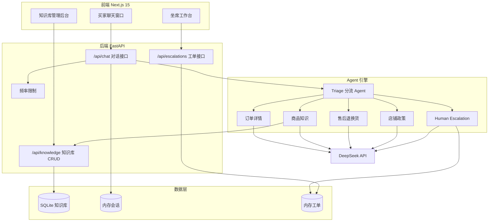
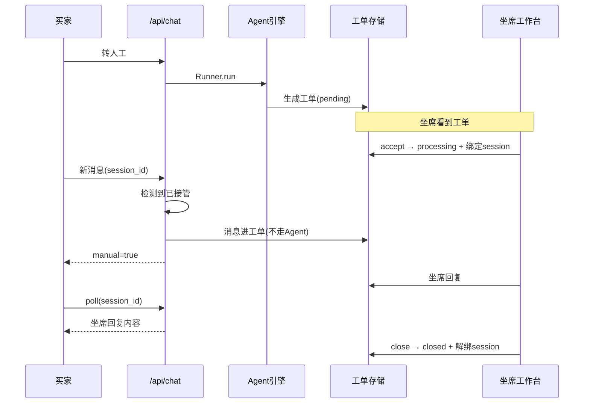

# AI 电商智能客服系统 — 技术方案文档

> 文档版本：v0.1（草稿，待评审）
> 编写日期：2026-08-19
> 状态：🚧 待用户确认
> 关联文档：《需求分析文档.md》v0.2

---

## 一、技术选型

| 层次 | 技术 | 版本 | 选型理由 | 备选方案 |
|------|------|------|---------|---------|
| 前端框架 | Next.js | 15 | SSR + API 路由，方便后续对接电商平台嵌入场景 | Vue3 / 纯 React |
| UI 样式 | TailwindCSS | 3 | 原子化样式，快速搭建，无需手写 CSS | Ant Design / Element Plus |
| 后端框架 | FastAPI | 0.1x | 原生 async、自动 OpenAPI 文档、类型安全 | Flask / Django |
| Agent 框架 | OpenAI Agents SDK | 最新 | 原生 Handoff 机制、Guardrail、多 Agent 编排，OpenAI 官方 | LangChain / LangGraph |
| LLM | DeepSeek `deepseek-chat` | — | 成本低、中文能力强、OpenAI 兼容协议 | GPT-4o / Claude |
| 向量库 | ChromaDB（规划） | — | 轻量、Python 原生、可嵌入 | Milvus / pgvector |
| 数据库 | SQLite（起步） | 3 | 零配置、快速跑通，预留 tenant_id 迁 PostgreSQL | PostgreSQL（生产） |
| 会话存储 | 内存字典（起步） | — | 演示够用，30min TTL | Redis（生产） |
| 限流 | 内存滑动窗口 | — | 简单版，单机够用 | Redis 令牌桶（生产） |

### 关键技术选型决策

**为什么用 OpenAI Agents SDK 而不是 LangChain？**

| 维度 | OpenAI Agents SDK | LangChain |
|------|-------------------|-----------|
| Handoff（Agent 交接） | 原生一等公民，交接时自动携带上下文 | 需手动管理状态传递 |
| Guardrail（护栏） | 内置 `@input_guardrail`，每个 Agent 独立配置 | 无原生概念，需自己实现 |
| 学习曲线 | 平缓，Agent 概念清晰 | 陡峭，抽象层多 |
| 适用场景 | 明确的多 Agent 协作 | 复杂工作流编排 |

本项目核心是"6 个专业 Agent 接力协作"，Handoff 是刚需，因此选择 Agents SDK。

**为什么 DeepSeek？**
- `deepseek-chat` 成本约为 GPT-4o 的 1/10
- 中文电商客服场景表现良好
- 兼容 OpenAI API 协议，可平滑切换（`MODEL` 变量一处修改）

---

## 二、总体架构



### 分层职责

| 层 | 职责 | 关键约束 |
|----|------|---------|
| 前端 | 三角色界面，轮询获取实时状态 | 不持有业务逻辑，纯展示 + 交互 |
| 后端 | HTTP 入口、校验、限流、会话、工单管理 | 无状态（除内存缓存），可水平扩展 |
| Agent 引擎 | 意图分流、业务处理、工具调用 | 由 SDK 编排，业务逻辑在工具函数 |
| 数据层 | 知识库、会话、工单持久化 | 知识库 SQLite，其余内存（生产迁 Redis/DB） |

---

## 三、核心模块设计

### 3.1 Agent 引擎（核心）

#### 6 Agent 编排

```
Triage（分流）→ 专业 Agent →（复杂）→ Human Escalation
```

| Agent | 工具 | Handoff 目标 |
|-------|------|-------------|
| Triage Agent | — | 全部 5 个专业 Agent |
| 订单详情 | order_status / list_orders / tracking_lookup | 售后退换货, Triage |
| 商品知识 | knowledge_search / product_info / search_products / inventory_check | 店铺政策, Triage |
| 售后退换货 | initiate_return / cancel_order / faq_lookup / escalate | 店铺政策, 人工, Triage |
| 店铺政策 | faq_lookup / rag_search / coupon_lookup | 人工, Triage |
| Human Escalation | escalate_to_human | Triage |

#### Handoff 上下文传递机制

每次 Handoff 通过 `ECommerceAgentContext`（共享状态）传递，接收方无需重复询问：

```python
class ECommerceAgentContext(BaseModel):
    customer_name: str | None = None
    order_number: str | None = None
    product_name: str | None = None
    escalation_flag: bool = False
    # ... 共 16 个字段
```

#### 安全兜底

- `max_turns=10`：防止 Agent 无限循环
- 异常分级降级：`ModelBehaviorError`（DeepSeek JSON 兼容问题）、`MaxTurnsExceeded`、通用异常，各自有用户友好提示

### 3.2 知识库模块

#### 数据模型（SQLite）

```sql
CREATE TABLE product_knowledge (
    id INTEGER PRIMARY KEY AUTOINCREMENT,
    tenant_id TEXT NOT NULL DEFAULT 'default',  -- 多租户预留
    product_id TEXT NOT NULL DEFAULT '',
    name TEXT NOT NULL,
    description TEXT DEFAULT '',
    selling_points TEXT DEFAULT '',  -- 换行分隔
    specs TEXT DEFAULT '',
    faq TEXT DEFAULT '',
    created_at TEXT, updated_at TEXT
);
```

#### 检索方式

| 阶段 | 方式 | 说明 |
|------|------|------|
| 当前 | SQLite `LIKE` 关键词匹配 | 已实现，`knowledge_search_tool` |
| 规划 | ChromaDB 向量检索（RAG） | 语义相似度，支持模糊问法 |

**RAG 演进路径**（待确认）：
1. 关键词匹配（当前）→ 2. 混合检索（关键词 + 向量）→ 3. 重排序 + 引用溯源

### 3.3 人工接管模块（Human-in-the-Loop）

#### 消息流设计



#### 关键设计

- `_manual_sessions: Dict[session_id, ticket_id]`：被接管会话映射
- `/api/chat` 在跑 Agent **之前**先查接管状态，实现"无缝切换"（买家无感知）
- 买家端 `useRef` 记录已轮询消息数，避免重复渲染

---

## 四、API 接口设计

### 对话接口

| 方法 | 路径 | 说明 |
|------|------|------|
| POST | `/api/chat` | 核心对话，返回 reply + agent_trace + escalation + session_id |
| GET | `/api/chat/poll?session_id=` | 买家轮询坐席回复 |

### 知识库接口

| 方法 | 路径 | 说明 |
|------|------|------|
| GET | `/api/knowledge` | 列表 |
| POST | `/api/knowledge` | 新增 |
| PUT | `/api/knowledge/{id}` | 更新 |
| DELETE | `/api/knowledge/{id}` | 删除 |
| GET | `/api/knowledge/search?q=` | 搜索 |

### 工单接口

| 方法 | 路径 | 说明 |
|------|------|------|
| GET | `/api/escalations` | 工单列表 |
| POST | `/api/escalations/{id}/accept` | 坐席接入 |
| GET | `/api/escalations/{id}/messages` | 对话记录 |
| POST | `/api/escalations/{id}/reply` | 坐席回复 |
| POST | `/api/escalations/{id}/close` | 关闭工单 |

### 其他

| 方法 | 路径 | 说明 |
|------|------|------|
| GET | `/api/agents` | Agent 列表（前端面板） |
| GET | `/health` | 健康检查 |

---

## 五、安全设计

| 安全项 | 实现 | 状态 |
|--------|------|------|
| 输入护栏 | `relevance_guardrail`（内容相关性）+ `jailbreak_guardrail`（越狱检测），每 Agent 独立 | ✅ |
| 输入校验 | 空消息 / 超 1000 字拦截 | ✅ |
| 循环上限 | `max_turns=10` | ✅ |
| 异常降级 | 3 种异常分级处理 | ✅ |
| 频率限制 | 内存滑动窗口（60s/30次） | ✅ |
| CORS | 环境变量 `FRONTEND_URL` 控制 | ✅ |
| 多租户隔离 | `tenant_id` 字段预留 | ⚠️ 待实现 |
| 认证授权 | 坐席/运营身份验证 | ❌ 待实现 |

---

## 六、性能与可靠性

| 项 | 方案 | 说明 |
|----|------|------|
| 会话过期 | 30min TTL 自动清理 | 防内存泄漏 |
| 限流清理 | 字典超 10000 IP 整体清空 | 防内存膨胀 |
| 异步处理 | FastAPI async + Agent 异步执行 | 高并发友好 |
| 降级策略 | 模型异常 → 友好提示 | 不暴露技术细节给用户 |
| 前端实时性 | 轮询（2s） | 规划升级 SSE/WebSocket |

---

## 七、部署方案

### 当前（本地开发）

```
后端: uvicorn main:app --port 8000
前端: next build && next start --port 3000
代理: Next.js rewrites /api/* → 127.0.0.1:8000
```

### 生产规划（待确认，目标"真实给客户用"）

```
┌─────────┐   ┌─────────┐   ┌──────────────┐
│ Nginx   │ → │ 前端静态 │ + │ 后端 Gunicorn │
│ 反向代理 │   │ 资源     │   │ + Uvicorn    │
└─────────┘   └─────────┘   └──────────────┘
                                    ↓
                        ┌───────────────────┐
                        │ Redis（会话+限流） │
                        └───────────────────┘
                                    ↓
                        ┌───────────────────┐
                        │ PostgreSQL（知识库+工单）│
                        └───────────────────┘
```

Docker Compose 组件：前端容器、后端容器、Redis、PostgreSQL、ChromaDB。

---

## 八、多租户设计（规划）

目标：不同电商客户各自独立的知识库。

| 设计点 | 方案 |
|--------|------|
| 租户标识 | `tenant_id` 字段（已预留） |
| 数据隔离 | 方案 A：单库 + tenant_id 过滤；方案 B：每租户独立库 |
| 推荐 | 初期方案 A（单库 + tenant_id 过滤），数据量大后迁方案 B |
| 认证 | 坐席/运营登录时绑定 tenant_id |

---

## 九、技术风险与应对

| 风险 | 影响 | 应对 |
|------|------|------|
| DeepSeek function calling 兼容性 | 复杂工具调用输出非法 JSON | 已做 `ModelBehaviorError` 降级；可选换模型 |
| 内存存储丢数据 | 重启后会话/工单丢失 | 生产迁 Redis + PostgreSQL |
| SQLite 并发弱 | 多租户高并发下性能差 | 迁 PostgreSQL |
| 轮询延迟 | 买家收到坐席回复有 2s 延迟 | 升级 SSE / WebSocket |
| RAG 知识库未灌数据 | FAQ 只能关键词匹配 | 补向量检索 |

---

## 十、待确认事项

1. **RAG 演进**：是否要做向量检索（ChromaDB），还是保持关键词匹配？
2. **认证授权**：坐席/运营是否需要登录系统？（多租户前提下必须）
3. **实时通信**：轮询是否够用，还是要升级 SSE/WebSocket？
4. **Docker 化**：何时开始 Docker 化部署？
5. **数据库迁移**：SQLite → PostgreSQL 的迁移时机？
6. **多租户隔离方案**：A（单库+过滤）还是 B（独立库）？

---

*请直接在本文档上修改，或把第十节的编号逐条回复你的决定。*
