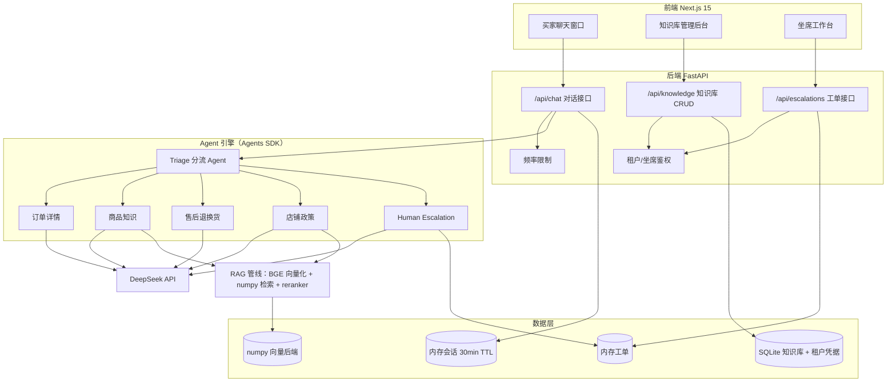
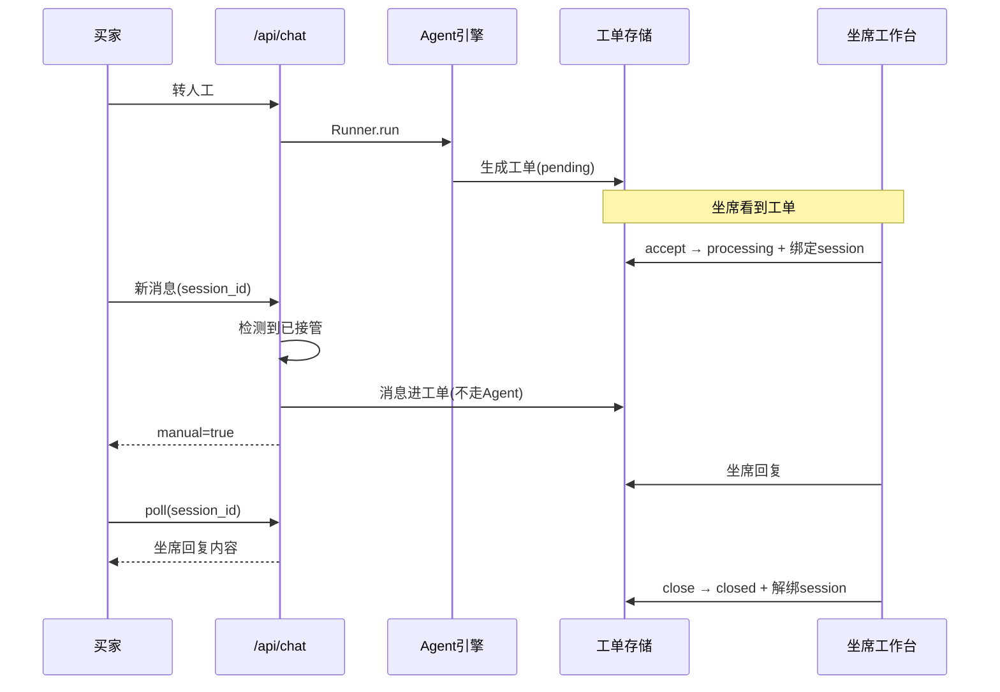

# AI 电商智能客服系统 — 技术方案文档

> 文档版本：v1.0
> 更新日期：2026-09-17
> 状态：✅ 与当前代码一致（实测回填）
> 关联文档：《需求分析文档.md》v1.0、《DESIGN.md》v1.1、`AGENTS.md`

---

## 一、技术选型

| 层次 | 技术 | 现状 | 选型理由 |
|------|------|------|---------|
| 前端框架 | Next.js 15 + React | ✅ 已实现 | SSR + API 路由，rewrites 代理后端，方便后续对接电商平台嵌入 |
| UI 样式 | TailwindCSS 3 + shadcn/ui | ✅ 已实现 | 原子化样式，快速搭建 |
| 后端框架 | FastAPI + Uvicorn | ✅ 已实现 | 原生 async、自动 OpenAPI 文档、类型安全 |
| Agent 框架 | OpenAI Agents SDK | ✅ 已实现 | 原生 Handoff、input_guardrail、多 Agent 编排 |
| LLM | DeepSeek `deepseek-chat` | ✅ 已实现 | 成本低（约 GPT-4o 1/10）、中文强、OpenAI 兼容协议 |
| 嵌入模型 | BGE-small-zh | ✅ 已实现 | 中文语义向量化，本地下载 |
| 重排模型 | bge-reranker | ✅ 已实现 | 精排提升检索精度 |
| 向量库 | 自建 numpy 后端（SQLite + numpy cosine） | ✅ 已实现 | 原 ChromaDB 1.5.x 在 Windows 上 hnsw 崩溃，自建接口兼容后端 |
| 数据库 | SQLite（`tenant_id` 字段 + `tenants` 鉴权表） | ✅ 已实现 | 零配置起步，预留迁 PostgreSQL |
| 会话存储 | 内存字典 + 30min TTL | ✅ 已实现 | 演示够用，生产迁 Redis |
| 限流 | 内存滑动窗口（60s/30 次） | ✅ 已实现 | 单机够用，生产迁 Redis 令牌桶 |
| 鉴权 | api_key sha256 哈希 + FastAPI 依赖 | ✅ 已实现 | 最小后端版，租户/坐席两档角色 |
| MCP | FastMCP（4 个工具） | ✅ 已实现 | 对外暴露商品/订单查询能力 |
| 编排增强 | LangGraph 售后状态机 | ⚠️ 独立原型，未接入主链路 | 见「边界与不做的事」 |

### 关键技术选型决策

**为什么用 OpenAI Agents SDK 而不是 LangChain？**

| 维度 | OpenAI Agents SDK | LangChain |
|------|-------------------|-----------|
| Handoff（Agent 交接） | 原生一等公民，交接时自动携带上下文 | 需手动管理状态传递 |
| Guardrail（护栏） | 内置 `@input_guardrail`，每个 Agent 独立配置 | 无原生概念，需自己实现 |
| 学习曲线 | 平缓，Agent 概念清晰 | 陡峭，抽象层多 |
| 适用场景 | 明确的多 Agent 协作 | 复杂工作流编排 |

本项目核心是「6 个专业 Agent 接力协作」，Handoff 是刚需，因此选 Agents SDK。

**为什么向量库从 ChromaDB 换成自建 numpy 后端？**

ChromaDB 1.5.x 的 hnsw segment（Rust 实现）在 Windows 上生成索引文件失败，导致 `collection.query()` 抛 `Error loading hnsw index`。数据实际在（sqlite 的 `embedding_metadata` 表），但检索不可用。决策：

- 自建 SQLite + numpy 后端，语义等价（embedding + cosine + top-k）
- 接口兼容层（`vector_store.py`），可平滑迁移回 chromadb
- 收益：1305 chunks 检索 < 50ms，去掉 chromadb ~100MB 依赖

**为什么 DeepSeek？**
- `deepseek-chat` 成本约为 GPT-4o 的 1/10
- 中文电商客服场景表现良好
- 兼容 OpenAI API 协议，`MODEL` 变量一处切换

---

## 二、总体架构


```mermaid
graph TB
    subgraph 前端["前端 Next.js 15"]
        Buyer[买家聊天窗口]
        Operator[知识库管理后台]
        Agent[坐席工作台]
    end

    subgraph 后端["后端 FastAPI"]
        ChatAPI["/api/chat 对话接口"]
        KnowledgeAPI["/api/knowledge 知识库 CRUD"]
        EscalationAPI["/api/escalations 工单接口"]
        Auth[租户/坐席鉴权]
        RateLimit[频率限制]
    end

    subgraph Agent引擎["Agent 引擎（Agents SDK）"]
        Triage[Triage 分流 Agent]
        Order[订单详情]
        Product[商品知识]
        AfterSales[售后退换货]
        Policy[店铺政策]
        Human[Human Escalation]
    end

    subgraph 数据层["数据层"]
        SQLite[(SQLite 知识库 + 租户凭据)]
        Vector[(numpy 向量后端)]
        Memory[(内存会话 30min TTL)]
        Tickets[(内存工单)]
    end

    LLM[DeepSeek API]
    RAG[RAG 管线：BGE 向量化 + numpy 检索 + reranker]

    Buyer --> ChatAPI
    Operator --> KnowledgeAPI
    Agent --> EscalationAPI
    ChatAPI --> RateLimit
    KnowledgeAPI --> Auth
    EscalationAPI --> Auth
    ChatAPI --> Triage
    Triage --> Order & Product & AfterSales & Policy & Human
    Order & Product & AfterSales & Policy & Human --> LLM
    Product --> RAG
    Policy --> RAG
    RAG --> Vector
    KnowledgeAPI --> SQLite
    ChatAPI --> Memory
    Human --> Tickets
    EscalationAPI --> Tickets
```

### 分层职责

| 层 | 职责 | 关键约束 |
|----|------|---------|
| 前端 | 三角色界面，轮询获取实时状态 | 不持有业务逻辑，纯展示 + 交互 |
| 后端 | HTTP 入口、鉴权、限流、会话、工单管理 | 无状态（除内存缓存），可水平扩展 |
| Agent 引擎 | 意图分流、业务处理、工具调用 | 由 SDK 编排，业务逻辑在工具函数 |
| 数据层 | 知识库、租户凭据、会话、工单 | 知识库 SQLite，向量 numpy，会话/工单内存（生产迁 Redis/DB） |

---

## 三、核心模块设计

### 3.1 Agent 引擎（核心）

#### 6 Agent 编排

```
Triage（分流）→ 专业 Agent →（复杂）→ Human Escalation
```

| Agent | 工具数 | 工具 | Handoff 目标 |
|-------|--------|------|-------------|
| Triage Agent | 0 | — | 全部 5 个专业 Agent |
| 订单详情 Agent | 3 | order_status_tool / list_customer_orders_tool / tracking_lookup_tool | 售后退换货, Triage |
| 商品知识 Agent | 4 | knowledge_search_tool / product_info_tool / search_products_tool / inventory_check_tool | 店铺政策, Triage |
| 售后退换货 Agent | 4 | initiate_return_tool / cancel_order_tool / faq_lookup_tool / escalate_to_human_tool | 店铺政策, 人工, Triage |
| 店铺政策 Agent | 3 | faq_lookup_tool / rag_search_tool / coupon_lookup_tool | 人工, Triage |
| Human Escalation Agent | 1 | escalate_to_human_tool | Triage |

> 业务工具去重后共 **13 个 function_tool**（`tools.py`），另有 2 个 Guardrail verdict 工具（`submit_relevance_verdict` / `submit_jailbreak_verdict`，在 `guardrails.py`）和 4 个 MCP 工具（`mcp_server.py`）。

#### Handoff 上下文传递机制

每次 Handoff 通过 `ECommerceAgentContext`（共享状态）传递，接收方无需重复询问。共 **17 个字段**（`ecommerce/context.py`）：用户信息（2）、订单（4）、商品（3）、售后（3）、优惠券（2）、人工接管（2）、内部字段（1，`internal_notes` 不展示给前端）。

> 注意：Handoff 工具名统一用英文 `tool_name_override`（如 `transfer_to_order_tracking`），因为 SDK 按 `agent.name` 生成工具名，中文名会被清洗成下划线导致冲突。

#### 安全兜底

- `max_turns=10`：防止 Agent 无限循环
- 异常分级降级：`ModelBehaviorError`（DeepSeek JSON 兼容问题）、`MaxTurnsExceeded`、通用异常，各自有用户友好提示
- 每 Agent 配 2 个 input_guardrail（相关性 + 越狱）

### 3.2 知识库模块

#### 数据模型（SQLite）

```sql
CREATE TABLE product_knowledge (
    id INTEGER PRIMARY KEY AUTOINCREMENT,
    tenant_id TEXT NOT NULL DEFAULT 'default',  -- 多租户隔离字段
    product_id TEXT NOT NULL DEFAULT '',
    name TEXT NOT NULL,
    description TEXT DEFAULT '',
    selling_points TEXT DEFAULT '',
    specs TEXT DEFAULT '',
    faq TEXT DEFAULT '',
    created_at TEXT, updated_at TEXT
);
```

- 查询层已做 `WHERE tenant_id=?` 过滤（`knowledge_store.py`）
- 知识库支持：手动 CRUD、CSV 批量导入、PDF/Word/TXT 文档 LLM 抽取导入

#### 检索方式（现状）

| 工具 | 主路径 | 兜底 |
|------|--------|------|
| `knowledge_search_tool`（商品） | RAG 向量 + 重排（type_filter=product） | SQLite `LIKE` 关键词 |
| `faq_lookup_tool`（政策） | RAG 向量 + 重排（type_filter=policy） | 规则匹配（`_FALLBACK_TOPIC_MAP`） |
| `rag_search_tool`（纯语义） | RAG 向量（无兜底） | 返回"暂无命中" |

**RAG 演进结论（已定论，非待确认）**：混合检索（BM25+向量+RRF）在 EcomRetrieval 基准实测中被推翻，**默认纯向量 + 重排**；BM25/混合检索保留为可插拔兜底（`use_hybrid=True`）。

语料规模：**1328 chunks**（1321 product + 7 policy，经 `import_real_products.py` 导入）。

### 3.3 人工接管模块（Human-in-the-Loop）

#### 消息流设计


```mermaid
sequenceDiagram
    participant B as 买家
    participant C as /api/chat
    participant A as Agent引擎
    participant T as 工单存储
    participant W as 坐席工作台

    B->>C: 转人工
    C->>A: Runner.run
    A->>T: 生成工单(pending)
    Note over W,T: 坐席看到工单
    W->>T: accept → processing + 绑定session
    B->>C: 新消息(session_id)
    C->>C: 检测到已接管
    C->>T: 消息进工单(不走Agent)
    C-->>B: manual=true
    W->>T: 坐席回复
    B->>C: poll(session_id)
    C-->>B: 坐席回复内容
    W->>T: close → closed + 解绑session
```

#### 关键设计

- `_manual_sessions: Dict[session_id, ticket_id]`：被接管会话映射
- `/api/chat` 在跑 Agent **之前**先查接管状态，实现「无缝切换」（买家无感知）
- 坐席工作台 UI 已实现（`ui/components/agent-workspace.tsx`，248 行）

---

## 四、API 接口设计

### 对话接口

| 方法 | 路径 | 说明 |
|------|------|------|
| POST | `/api/chat` | 核心对话，返回 reply + agent_trace + escalation + session_id |
| GET | `/api/chat/poll?session_id=` | 买家轮询坐席回复 |

### 知识库接口（租户鉴权）

| 方法 | 路径 | 说明 |
|------|------|------|
| GET | `/api/knowledge` | 列表（无 key 走 default 只读） |
| POST | `/api/knowledge` | 新增（需 API Key） |
| PUT | `/api/knowledge/{id}` | 更新（需 API Key） |
| DELETE | `/api/knowledge/{id}` | 删除（需 API Key） |
| GET | `/api/knowledge/search?q=` | 搜索 |

### 工单接口（坐席鉴权）

| 方法 | 路径 | 说明 |
|------|------|------|
| GET | `/api/escalations` | 工单列表 |
| POST | `/api/escalations/{id}/accept` | 坐席接入（需坐席角色） |
| GET | `/api/escalations/{id}/messages` | 对话记录 |
| POST | `/api/escalations/{id}/reply` | 坐席回复（需坐席角色） |
| POST | `/api/escalations/{id}/close` | 关闭工单（需坐席角色） |

### 其他

| 方法 | 路径 | 说明 |
|------|------|------|
| GET | `/api/agents` | Agent 列表（前端面板） |
| GET | `/health` | 健康检查（返回 agents="6"） |

---

## 五、安全设计

| 安全项 | 实现 | 状态 |
|--------|------|------|
| 输入护栏 | `relevance_guardrail`（内容相关性）+ `jailbreak_guardrail`（越狱检测），每 Agent 独立配置，function-tool 方式实现 | ✅ |
| 输入校验 | 空消息 / 超 1000 字拦截 | ✅ |
| 循环上限 | `max_turns=10` | ✅ |
| 异常降级 | 3 种异常分级处理 | ✅ |
| 频率限制 | 内存滑动窗口（60s/30 次，`main.py`） | ✅ |
| CORS | 环境变量 `FRONTEND_URL` 控制 | ✅ |
| 租户鉴权 | api_key sha256 哈希 + `get_current_tenant` 依赖（`auth.py`） | ✅ |
| 坐席鉴权 | `require_agent_role` 依赖，坐席工单接口限定 role='agent' | ✅ |
| 多租户隔离 | `tenant_id` 查询层过滤 + 输入层鉴权 | ✅ 已实现 |
| API Key 轮换 | — | ❌ 未实现 |
| 请求日志持久化 | — | ❌ 未实现 |

> 鉴权口径（诚实边界）：`tenant_id` 查询层已过滤 + 输入层已加 API Key 鉴权，但 Key 本身是静态的（无轮换/过期机制），生产环境需接入正式身份体系。

---

## 六、性能与可靠性

| 项 | 方案 | 说明 |
|----|------|------|
| 会话过期 | 30min TTL 自动清理 | 防内存泄漏 |
| 限流清理 | 字典超 10000 IP 整体清空 | 防内存膨胀 |
| 异步处理 | FastAPI async + Agent 异步执行 | 高并发友好 |
| 降级策略 | 模型异常 → 友好提示 | 不暴露技术细节给用户 |
| 前端实时性 | 轮询（2s） | 规划升级 SSE/WebSocket |
| 向量检索性能 | numpy cosine top-k | 1305 chunks < 50ms |

---

## 七、部署方案

### 当前（本地开发）

```
后端: uvicorn main:app --port 8000
前端: next build && next start --port 3000
代理: Next.js rewrites /api/* → 127.0.0.1:8000
```

### 容器化（已实现）

- `python-backend/Dockerfile`：CPU torch + 国内源，镜像 6GB → 2.6GB
- `docker-compose.yml`：前端容器 + 后端容器 + 模型卷挂载（numpy 后端无需独立向量库容器）

### 生产规划（待上线，目标「真实给客户用」）

```
┌─────────┐   ┌─────────┐   ┌──────────────┐
│ Nginx   │ → │ 前端静态 │ + │ 后端 Gunicorn │
│ 反向代理 │   │ 资源     │   │ + Uvicorn    │
└─────────┘   └─────────┘   └──────────────┘
                                    ↓
                        ┌───────────────────┐
                        │ Redis（会话+限流） │
                        └───────────────────┘
                                    ↓
                        ┌───────────────────┐
                        │ PostgreSQL（知识库+工单）│
                        └───────────────────┘
```

---

## 八、多租户设计（已实现）

目标：不同电商客户各自独立的知识库。

| 设计点 | 方案 | 状态 |
|--------|------|------|
| 租户标识 | `tenant_id` 字段（知识库表 + tenants 鉴权表） | ✅ |
| 数据隔离 | 单库 + `WHERE tenant_id=?` 查询层过滤 | ✅ |
| 输入层鉴权 | api_key → tenant_id 映射（`get_current_tenant`） | ✅ |
| 坐席角色 | `role='agent'` 限定工单操作（`require_agent_role`） | ✅ |
| 生产演进 | 数据量大后迁 PostgreSQL + 正式身份体系 | 规划 |

---

## 九、技术风险与应对

| 风险 | 影响 | 应对 |
|------|------|------|
| DeepSeek function calling 兼容性 | 复杂工具调用输出非法 JSON | 已做 `ModelBehaviorError` 降级；Guardrail 用 function-tool 而非 output_type 规避 |
| 内存存储丢数据 | 重启后会话/工单丢失 | 生产迁 Redis + PostgreSQL |
| SQLite 并发弱 | 多租户高并发下性能差 | 迁 PostgreSQL |
| 轮询延迟 | 买家收到坐席回复有 2s 延迟 | 升级 SSE / WebSocket |
| 静态 API Key | Key 无轮换/过期，泄露即越权 | 生产接入正式身份体系（OAuth/JWT） |
| 向量库无持久化重建 | 索引文件损坏需重建 | `indexer.py` backend 自动重建 |

---

## 十、与《需求分析文档》的边界对齐

本方案「已实现」的边界，与《需求分析文档》v1.0 第六章「边界与不做的事」保持一致：

- LangGraph 售后状态机（`after_sales_graph.py`）为**独立验证原型，未接入主链路**
- 多租户是「字段 + 查询层过滤 + API Key 鉴权」，非完整 RBAC 体系
- 系统**未上线**，无生产流量、无真实用户
- CI 已建（smoke 测试），但**未跑真 LLM**（mock + fixture）
- API Key 静态、无轮换机制

---

*本文档为「技术实现方案」，业务需求边界见《需求分析文档.md》v1.0，编码规则见 `AGENTS.md`。*
